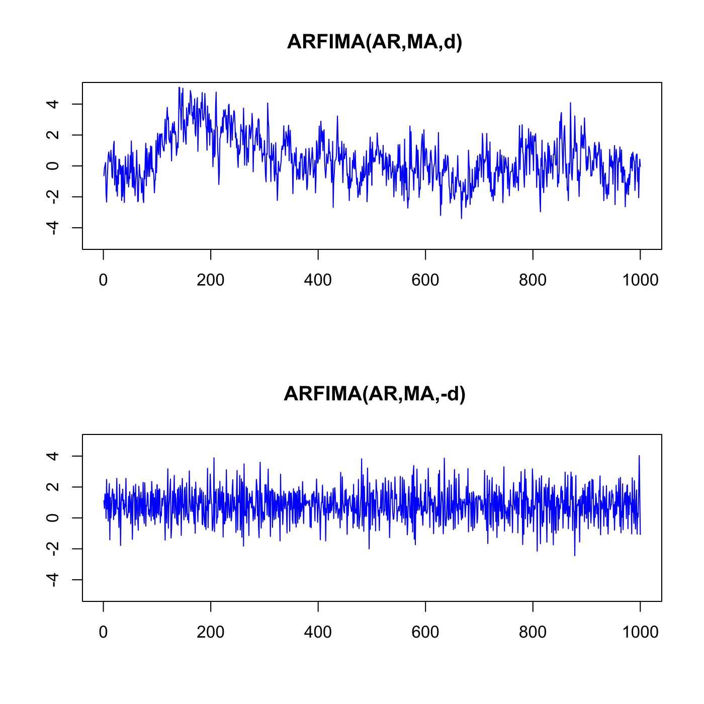

[](http://quantlet.de/index.php?p=info)

## [](http://quantlet.de/) **SFEarfima** [](http://quantlet.de/d3/ia)

```yaml

Name of QuantLet : SFEarfima

Published in : Statistics of Financial Markets

Description : Produces plots of the fractional integrated ARMA - ARFIMA(p,d,q) models.

Keywords : 'arfima, arma, autoregressive, moving-average, linear, discrete, time-series, process,
stochastic-process, stochastic, simulation, graphical representation, plot'

Author : Piotr Majer

Submitted : Tue, July 05 2011 by Maria Osipenko

Example : Plots of ARFIMA(AR,MA,d) (top) and ARFIMA(AR,MA,-d) (bottom) models.

Code warning: 
- 1: 'In fracdiff.sim(N, AR, MA, d1) :'
- 2: ar-part of fracdiff model is not stationary!!

```




### R Code:
```r

# clear variables and close windows
rm(list = ls(all = TRUE))
graphics.off()

# install and load packages
libraries = c("fracdiff")
lapply(libraries, function(x) if (!(x %in% installed.packages())) {
    install.packages(x)
})
lapply(libraries, library, quietly = TRUE, character.only = TRUE)

# parameter settings
d  = 0.4     # long memory parameter (stationary long memory property) for 0<d<0.5
N  = 1000    # length
AR = 1       # AR polynomial coefficients, i.e. [1 0.4 0.2]
MA = 1       # MA polynomial coefficients, i.e. [-0.3 0.4 0.5]
d1 = d
d2 = -d

# Main computation
arfima1 = fracdiff.sim(N, AR, MA, d1)
arfima2 = fracdiff.sim(N, AR, MA, d2)

# Plot
par(mfrow = c(2, 1))
plot(arfima1$series, main = " ARFIMA(AR,MA,d)", type = "l", col = "blue", xlab = "", ylab = "", ylim = c(-5, 
    5), cex.lab = 1.4)
plot(arfima2$series, main = " ARFIMA(AR,MA,-d)", type = "l", col = "blue", xlab = "", ylab = "", ylim = c(-5, 
    5), cex.lab = 1.4)

```
