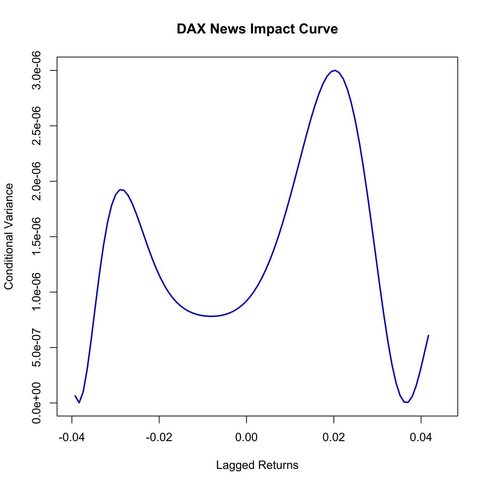
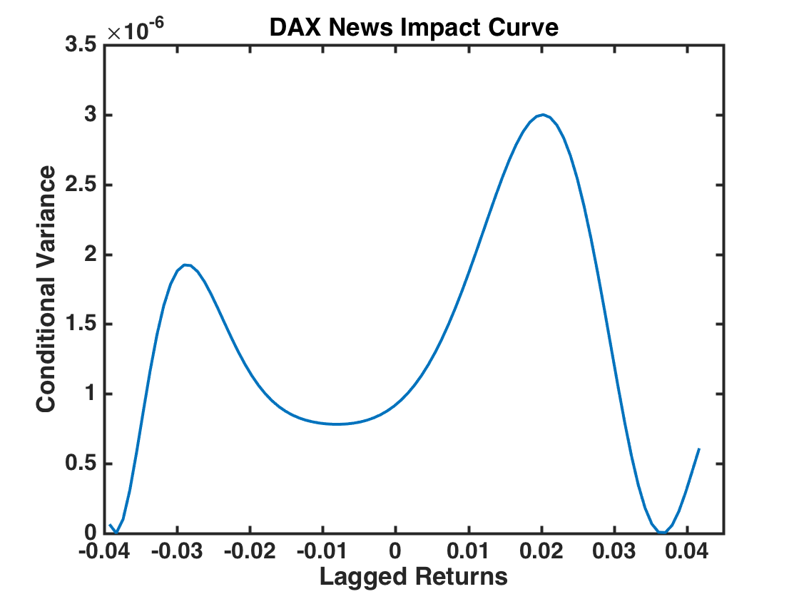

[](http://quantlet.de/index.php?p=info)

## [](http://quantlet.de/) **SFENewsImpactCurve** [](http://quantlet.de/d3/ia)

```yaml

Name of QuantLet : SFENewsImpactCurve

Published in : Statistics of Financial Markets

Description : 'Computes a local linear estimate of the News Impact Curve for the DAX return. The
model is y(t)=f(y(t-1)).'

Keywords : 'conditional variance, local polynomial, dax, returns, asset, financial, estimation,
linear, data visualization, graphical representation, plot'

See also : kern

Author : Awdesch Melzer

Author[Matlab] : Awdesch Melzer

Submitted : Wed, April 24 2013 by Maria Osipenko

Submitted[Matlab] : Wed, April 24 2013 by Maria Osipenko

Datafiles : dax99.dat

Example : Plot of conditional variance f^2.

```






### R Code:
```r

# clear variables and close windows
rm(list = ls(all = TRUE))
graphics.off()

sker = function(x, y, h, N, f) {
    # kernel regression smoothing for different kernel functions
    # kernel functions
    kern = function(x, f) {
        x = as.matrix(x)
        if (f == "gau") {
            # gaussian kernel
            y = dnorm(x)
        } else if (f == "qua") {
            # quartic / biweight kernel
            y = 0.9375 * (abs(x) < 1) * (1 - x^2)^2
        } else if (f == "cosi") {
            # cosine kernel
            y = (pi/4) * cos((pi/2) * x) * (abs(x) < 1)
        } else if (f == "tri") {
            # triweight kernel
            y = 35/32 * (abs(x) < 1) * (1 - x^2)^3
        } else if (f == "tria") {
            # triangular kernel
            y = (1 - abs(x)) * (abs(x) < 1)
        } else if (f == "uni") {
            # uniform kernel
            y = 0.5 * (abs(x) < 1)
        } else if (f == "spline") {
            # spline kernel
            y = 0.5 * (exp(-abs(x)/sqrt(2))) * (sin(abs(x)/sqrt(2) + pi/4))
        }
        return(y)
    }
      
    # Default parameters
    if (missing(N)) {
        N = 100
    }
    if (missing(f)) {
        f = "qua"
    }
    r.n = length(x)
    if (missing(h)) {
        stop("There is no enough variation in the data. Regression is meaningless.")
    }
    r.h = h
    r.x = seq(min(x), max(x), length = N)
    r.f = matrix(0, N)
    for (k in 1:N) {
        z = kern((r.x[k] - x)/h, f)
        r.f[k] = sum(z * y)/sum(z)
    }
    return(list(mx = r.x, mh = r.f))
}

# load data
data    = read.table("dax99.dat")
dax99   = data[, 2]  # first line is date, second XetraDAX 1999
lndax99 = log(dax99)
ret     = diff(lndax99)

lagret = ret  # create the vector with lagged returns
ret    = ret[2:length(ret)]
lagret = lagret[1:(length(lagret) - 1)]

h = 0.01  # bandwidth
N = 100  # length of estimation vector
kernel = "gau"  # kernel function: 'gau' - Gaussian, 'qua' - quartic, 'epa' - Epanechnikov, etc...

tmp = sker(lagret, ret, h, N, kernel)
mh  = matrix(0, N, 2)

mh[, 1] = tmp$mx
mh[, 2] = tmp$mh

NewsImpCurve  = matrix(0, N, 2)
NewsImpCurve[, 2] = mh[, 2]^2
NewsImpCurve[, 1] = mh[, 1]
NewsImpCurve1 = matrix(0, N, 2)
l = 1
for (i in 1:nrow(NewsImpCurve)) {
    if (NewsImpCurve[i, 1] < 0.042) {
        NewsImpCurve1[l, ] = NewsImpCurve[i, ]
        l = l + 1
    }
}

NewsImpCurve2 = matrix(0, N, 2)
m = 1
for (i in 1:nrow(NewsImpCurve1)) {
    if (NewsImpCurve1[i, 1] > -0.04) {
        NewsImpCurve2[m, ] = NewsImpCurve1[i, ]
        m = m + 1
    }
}

# plot
NewsImpCurve = NewsImpCurve2[(NewsImpCurve2[, 2] > 0), ]
plot(NewsImpCurve[, 1], NewsImpCurve[, 2], type = "l", col = "blue3", lwd = 2, 
    xlab = "Lagged Returns", ylab = "Conditional Variance", xlim = c(-0.04, 0.045))
title("DAX News Impact Curve")

```

### MATLAB Code:
```matlab
clear all
close all
clc

data=load('dax99.dat');

dax99   = data(:, 2);        % first line is date, second XetraDAX 1999
lndax99 = log(dax99);
ret     = diff(lndax99);


lagret = ret;				 % create the vector with lagged returns
ret    = ret(2:length(ret), :);
lagret = lagret(1:length(lagret) - 1, :);


[rx rf] = sker(lagret, ret, 0.01, 100, 'gau');


mh(:,1)      = rx';
mh(:,2)      = rf';
NewsImpCurve = mh(:, 2) .^ 2;
NewsImpCurve = [mh(:,1), NewsImpCurve];

l = 1;
for i = 1:length(NewsImpCurve)
    if NewsImpCurve(i,1) < 0.042
        NewsImpCurve1(l, :) = NewsImpCurve(i, :);
        l = l + 1;
    end
end

m = 1;
for i = 1:length(NewsImpCurve1)
    if NewsImpCurve1(i, 1) > -0.04
        NewsImpCurve2(m, :) = NewsImpCurve1(i, :);
        m = m + 1;
    end
end

NewsImpCurve = NewsImpCurve2;
plot(NewsImpCurve(:, 1), NewsImpCurve(:, 2), 'LineWidth', 2)
xlim([-0.04, 0.045])
title('DAX News Impact Curve', 'FontWeight', 'bold', 'FontSize', 16)
xlabel('Lagged Returns', 'FontWeight', 'bold', 'FontSize', 16)
ylabel('Conditional Variance', 'FontWeight', 'bold', 'FontSize', 16)
box on
set(gca,'FontSize', 16, 'LineWidth', 2, 'FontWeight', 'bold');

% print -painters -dpdf -r600 SFENewsImpactCurve.pdf
% print -painters -dpng -r600 SFENewsImpactCurve.png

```
