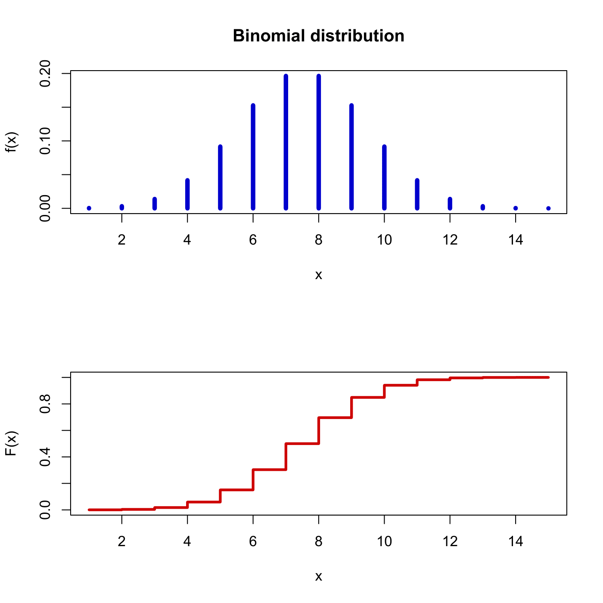
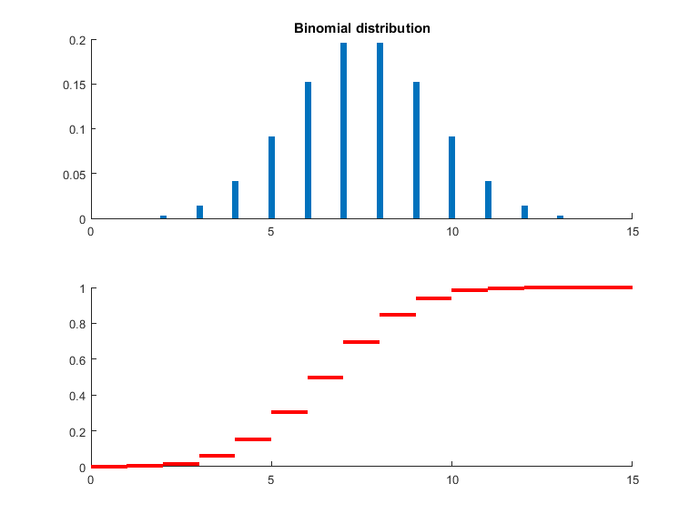
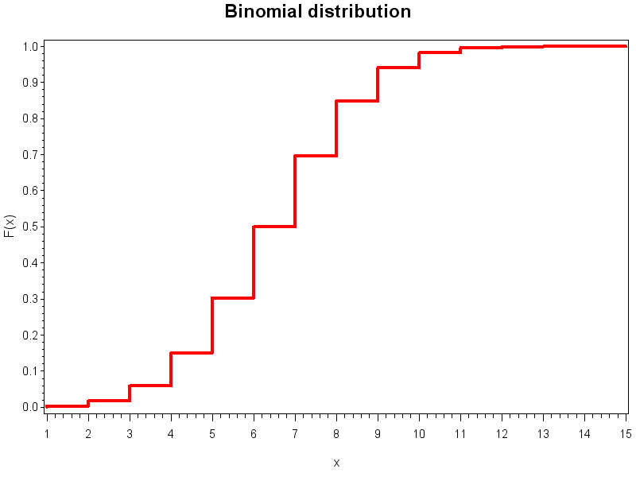
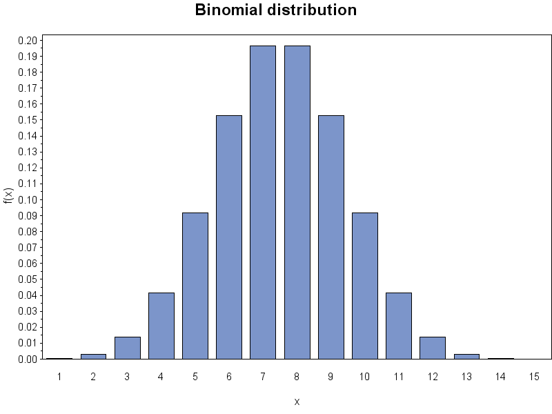

[](http://quantlet.de/index.php?p=info)

## [](http://quantlet.de/) **SFEBinomial** [](http://quantlet.de/d3/ia)

```yaml

Name of QuantLet : SFEBinomial

Published in : Statistics of Financial Markets

Description : 'Plots the density and distribution function of a binomial distributed random
variable with different parameters and calculates probabilities.'

Keywords : binomial, discrete, graphical representation, plot, random, cdf, pdf, density

See also : SFEBinomp, SFEbinomv, SFEbinomv_log

Author : Dedy D. Prastyo, Franziska Schulz

Author[SAS] : Daniel T. Pele

Submitted : Tue, May 17 2016 by Christoph Schult

Submitted[SAS] : Thu, April 24 2014 by Franziska Schulz

Input: 
- p: probability used for plot
- n: number used for plot
- x1: x used for calculation
- p1: probability used for calculation
- n1: number used for calculation

Example : An example is generated for the parameters [p,n]=[0.5,15] and [x1,p1,n1]=[5,0.5,15].

```










### R Code:
```r

# clear variables and close windows
rm(list = ls(all = TRUE))
graphics.off()

# parameter settings
para = c(0.5, 15)
p = para[1] # Probability
n = para[2] # Number n
x = 1:n

# plot
par(mfrow = c(2, 1))
y = dbinom(x, n, p)
plot(x, y, col = "blue3", lwd = 5, type = "h", main = "Binomial distribution", 
    ylab = "f(x)")
z = pbinom(x, n, p)
plot(x, z, col = "red3", lwd = 3, type = "s", ylab = "F(x)")

# parameter settings
para = c(5, 0.5, 15)
x1   = para[1] # Value of x
p1   = para[2] # Probability
n1   = para[3] # Number n

print("Binomial distribution for the specified x, p, n")
print("P(X=x) = f(x) =")
dbinom(x1, n1, p1)
print("P(X<=x) = F(x) =")
pbinom(x1, n1, p1)
print("P(X>=x) = 1-F(x-1) =")
1 - pbinom(x1 - 1, n1, p1)
print("P(X<x) = P(X<=x) - P(X=x) = P(X<=x-1) = F(x-1) =")
pbinom(x1 - 1, n1, p1)
print("P(X>x) = P(X>=x) - P(X=x) = P(X>=x+1) = 1 - F(x) =")
1 - pbinom(x1, n1, p1)

```

### MATLAB Code:
```matlab
clear all
close all
clc

disp('Please input [Probability, Number n] as: [0.5, 15]') ;
disp(' ') ;
para = input('[Probability, Number n] = ');
while length(para) < 2
    disp('Not enough input arguments. Please input in 1 * 2 vector form like [0.5, 15] or [0.5 15]');
    para = input('[Probability, Number n] = ');
end
p = para(1);
n = para(2);

x = 1:n;
subplot(2, 1, 1)
y = binopdf(x, n, p);

for i = 1:length(x)
    line([i, i],[0, y(i)], 'LineWidth', 5)
end
title('Binomial distribution') 

subplot(2, 1, 2)
z = binocdf(x, n, p);

for i = 1:length(x)
    line([i - 1, i], [z(i), z(i)], 'LineWidth', 3, 'Color', 'r')
end

% plot(x, z, '+')

disp('Please input [Value of x, Probability, Number n] as: [5, 0.5, 15]') ;
disp(' ') ;
para = input('[Value of x, Probability, Number n] = ');
while length(para) < 3
    disp('Not enough input arguments. Please input in 1 * 2 vector form like [5, 0.5, 15] or [5 0.5 15]');
    para = input('[Value of x, Probability, Number n] = ');
end
x1 = para(1);
p1 = para(2);
n1 = para(3);

disp(' ')
disp('Binomial distribution for the specified x, p, n')
disp(' ')
disp('P(X = x) = f(x) =')
binopdf(x1, n1, p1)
disp('P(X <= x) = F(x) =')
binocdf(x1, n1, p1)
disp('P(X >= x) = 1 - F(x - 1) =')
1 - binocdf(x1 - 1, n1, p1)
disp('P(X < x) = P(X <= x) - P(X = x) = P(X <= x - 1) = F(x - 1) =')
binocdf(x1 - 1, n1, p1)
disp('P(X > x) = P(X >= x) - P(X = x) = P(X >= x + 1) = 1 - F(x) =')
1 - binocdf(x1, n1, p1)
```

### SAS Code:
```sas

goptions reset=all;
proc iml;

*Please input (Probability p, Number n);
p     = 0.5;
n     = 15;
x     = (0:n)`;
y=pdf('Binomial',x,p,n); *pdf of Binomial distribution;
z=cdf('Binomial',x,p,n); *cdf of Binomial distribution;

data=x||y||z;
create data from data;append from data;
close data;
submit;

data data;set data;
rename col1=x;
rename col2=pdf_Binomial;
rename col3=cdf_Binomial;
run;
proc gchart data=data;                                                                                                                 
   vbar x / sumvar=pdf_Binomial discrete width=10 annotate=data                                                                       
              maxis=axis1 raxis=axis2;                                                                                                  
   axis1 label=('x');                                                                                                                 
   axis2 label=(angle=90 'f(x)');                                                                                                     
   title1 'Binomial distribution';                                                                                           
run;                                                                                                                                    
quit; 

symbol i=line interpol=STEPJR   w=3 c=red;
   axis1 label=('x');                                                                                                                 
   axis2 label=(angle=90 'F(x)');                                                                                                     
   title1 'Binomial distribution';                                                                                           

proc gplot data=data;                                                                                                                 
  plot cdf_Binomial*x/haxis=axis1 vaxis=axis2 ;                                                                                                  
run;                                                                                                                                    
quit; 

endsubmit;

*Please input (Value of x, Probability, Number n);
x1    = 5;
p1    = 0.5;
n1    = 15;
y=pdf('Binomial',x1,p1,n1);
print('Binomial distribution for the specified x, p, n') x1[label=none] p1[label=none] n1[label=none];
print('P(X=x) = f(x) =') y[label=none] ;

z=cdf('Binomial',x1,p1,n1);
print('P(X<=x) = F(x) =') z[label=none];
z1=1-z;
print('P(X>=x) = 1-F(x-1) =') z1[label=none];
v=pdf('Binomial',x1-1,p1,n1);
print('P(X<x) = P(X<=x) - P(X=x) = P(X<=x-1) = F(x-1) =') v[label=none];
y1=1-y;
print('P(X>x) = P(X>=x) - P(X=x) = P(X>=x+1) = 1 - F(x) =') y1[label=none];

quit;

```
