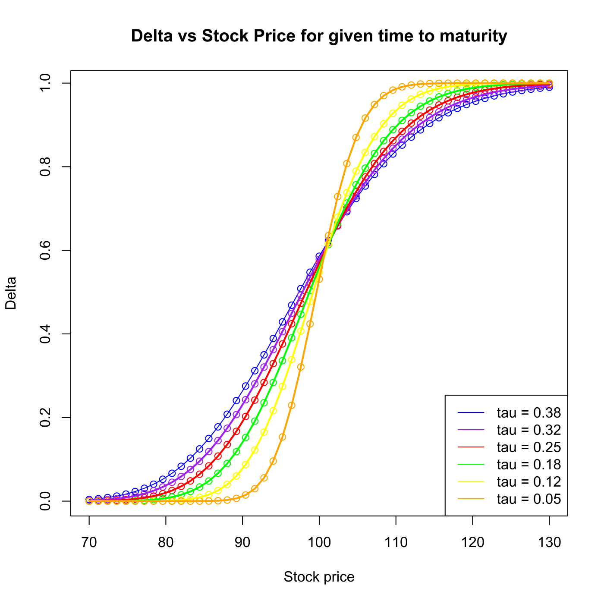

##  **SFEDeltahedgingdepend**

```yaml
Name of QuantLet : SFEDeltahedgingdepend Published in: Statistics of Financial Markets Description:
'Simulates 2 stock price paths, including the Black-Scholes Delta depending on n=50 time steps and
the stock price S1/S2 for given exercise price K=100, initial stock price S0=98, volatility
sig=0.2, interest rate r=0.05, and the time interval (T-t0) = 20 weeks. In the second part it plots
delta vs stock price for different time to maturities.' Keywords: black-scholes, brownian-motion,
data visualization, delta, financial, geometric-brownian-motion, graphical representation, hedging,
plot, simulation, stock-price, visualization, wiener-process See also: SFEDeltaHedging,
SFEDeltaHedging, SFEDeltahedgingLogic, SFEDeltahedgingLogic, SFSdeltahedging Author: Gagandeep
Singh Submitted: Wed, June 03 2015 by Lukas Borke Example: 'Plot of stock prices as geometric
brownian motion and calculation of delta at each point as time to maturity decreases.'
```





```r

# clear variables and close windows
rm(list = ls(all = TRUE))
graphics.off()


# Delta Hedging dependencies
# Plot 1: In this plot we plot stock prices as geometric brownian motion 
# and calculate delta at each point as time to maturity decreases

# parameter settings
S0    = 98      # Initial price
K     = 100     # strike price
r     = 0.05    # current expectation of returns
sigma = 0.2     # volatility , std deviations around the drift
T     = 26/52   # time to maturity is 26 weeks, here in yearstt
steps = 50
tp    = 6/52    # present time is 6 weeks 
dt    = (T - tp)/steps
t     = seq(tp, T, by = dt)
Tau   = T - t

# set pseudo random numbers
set.seed(80)

# function for blackscholes call delta
black_scholes_delta = function(S, K, Tau, r, sigma) {
    d1 = (log(S/K) + (r + ((sigma * sigma)/2) * Tau))/(sigma * sqrt(Tau))
    return(pnorm(d1))
}

# function for std wiener process
std_wiener_process = function() {
    Wt1 = rnorm(length(t) - 1, 0, 1)
    Wt = c(0, (dt^0.5) * cumsum(Wt1))
    return(Wt)
}

# layout dividing screen into two
split.screen(c(2, 1))

# First Stock path and its plot and delta calculation 
wt = std_wiener_process()  #std wiener function for first stock path
St1 = S0 * exp(((r - (sigma^2)/2) * dt) + (sigma * wt))
screen(1)
plot(t, St1, type = "l", col = "red", ylim = c(75, 135), xlab = "Time", ylab = "Stock price", 
    frame = TRUE, lwd = 2)  # plot
    
# line showing the strike price
delta1 = black_scholes_delta(St1, K, Tau, r, sigma)  # calculation of delta for first stock path through 

# black_scholes_delta function 
# First Stock path and its plot and delta calculation 
wt2 = std_wiener_process()
St2 = S0 * exp(((r - (sigma^2)/2) * dt) + (sigma * wt2))
lines(t, St2, type = "l", col = "blue", lwd = 2)
delta2 = black_scholes_delta(St2, K, Tau, r, sigma)
title("Simulated stock price paths")
abline(h = K, col = 1, lty = 2, lwd = 2)

# ploting of delta for the two stock paths 
screen(2)
plot(t, delta1, ylim = c(0, 1), col = "red", xlab = "Time", ylab = "Delta", 
    frame = TRUE, lwd = 2)
lines(t, delta1, col = "red", lwd = 2)
points(t, delta2, col = "blue", lwd = 2)
lines(t, delta2, col = "blue", lwd = 2)
abline(h = K, col = 1, lty = 2, lwd = 2)
title("Delta for simulated stock price paths")

# Plot 2
# We plot delta vs stock price for different time to maturities
# parameter settings
Smin   = 70         # lower bound of stock price
Smax   = 130        # upper bound of stock price
taumin = 0.05       # lower bound of time to maturity
taumax = 20/52      # upper bound of time to maturity
S0     = 98         # initial stock pricet
K      = 100        # strike price
r      = 0.05       # interest rate
sigma  = 0.2        # volatility
steps  = 50
tsteps = 5
T      = 26/52
St     = seq(Smax, Smin, by = -(Smax - Smin)/(steps))
taus   = seq(taumax, taumin, by = -(taumax - taumin)/tsteps)  # different time to maturity
delta  = matrix(0, (steps + 1), length(taus))

# function for delta
black_scholes_delta = function(S, K, Tau, r, sigma) {
    d1 = (log(S/K) + (r + sigma^2/2) * Tau)/(sigma * sqrt(Tau))
    return(pnorm(d1))
}

# calculation delta for the different Stock price at constant time to maturity
for (i in 1:length(taus)) {
    delta[, i] = black_scholes_delta(St, K, taus[i], r, sigma)
}
dev.new()
plot(St, delta[, 1], col = "blue", xlab = "Stock price", ylab = "Delta", main = "Delta vs Stock Price for given time to maturity")
lines(St, delta[, 1], col = "blue")

points(St, delta[, 2], col = "purple")
points(St, delta[, 3], col = "red")
points(St, delta[, 4], col = "green")
points(St, delta[, 5], col = "yellow")
points(St, delta[, 6], col = "orange")

lines(St, delta[, 2], col = "purple", lwd = 2)
lines(St, delta[, 3], col = "red", lwd = 2)
lines(St, delta[, 4], col = "green", lwd = 2)
lines(St, delta[, 5], col = "yellow", lwd = 2)
lines(St, delta[, 6], col = "orange", lwd = 2)

legend("bottomright", c(paste("tau =", round(taus[1:6], digits = 2))), col = c("blue", 
    "purple", "red", "green", "yellow", "orange"), lty = 1) 

```
