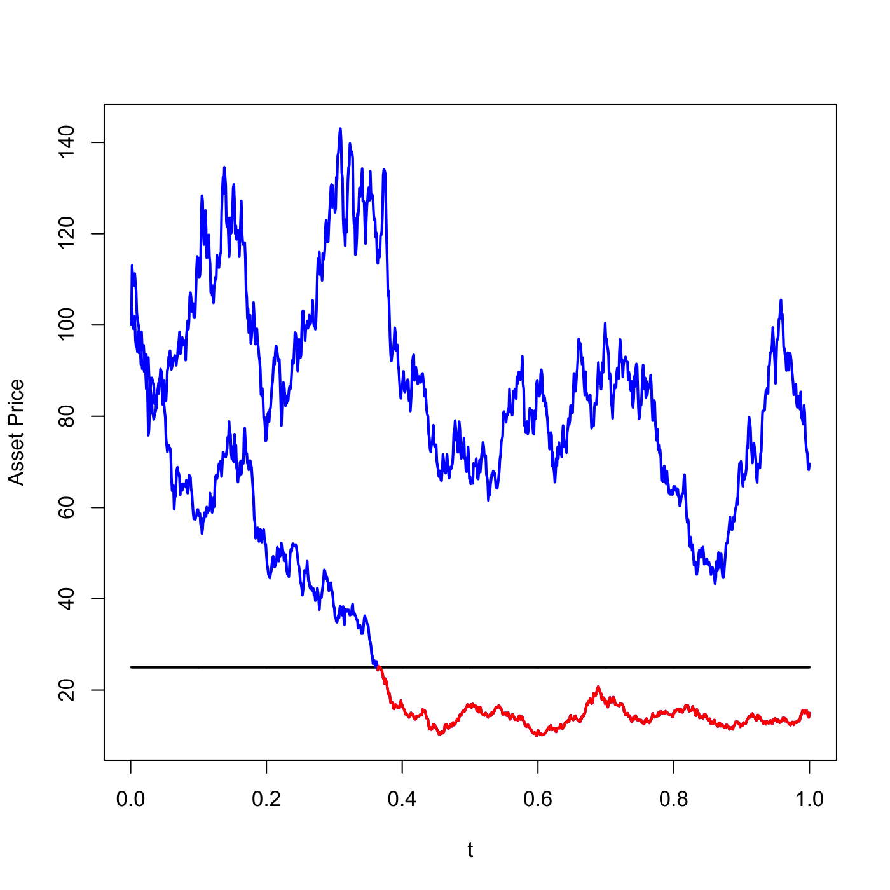

[](http://quantlet.de/index.php?p=info)

## [](http://quantlet.de/) **SFEdown-and-out** [](http://quantlet.de/d3/ia)

```yaml

Name of QuantLet : SFEdown-and-out

Published in : Statistics of Financial Markets

Description : 'Plots the situation for a down-and-out option with two possible paths of the asset
price. Once the price hits the barrier, the option expires worthless regardless of any further
evolution of the price.'

Keywords : 'asset, barrier-option, financial, geometric-brownian-motion, graphical representation,
option, option-price, plot, price, random-number-generation, random-walk, returns, simulation,
stochastic-process, stock-price'

Author : Maria de Lourdes Alavez Estevez, Awdesch Melzer

Author[Matlab] : Maria de Lourdes Alavez Estevez

Submitted : Thu, June 04 2015 by Lukas Borke

Submitted[Matlab] : Thu, April 28 2016 by Ya Qian

Example : 'User inputs the parameters [Stocks Initial Price, Interest Rate, Volatility, Barrier]
like [100,0.05,0.03,25]. Then 2 paths are simulated.'

```

.png)




### R Code:
```r

# clear variables and close windows
rm(list = ls(all = TRUE))
graphics.off()

# fix pseudo random numbers for reproducibility
set.seed(-1)

# interactive user input, e.g. (100, 0.05, 0.03, 25)
print("Please input Stock's Initial Price S0, Interest Rate per Year r,")
print("Volatility per year vol and Value of the barrier b")
print("For instance: s0 = 100 0.05 0.03 25")
print("Then press enter 2 times")
para = scan()

while (length(para) < 4 | length(para) > 4 | any(para <= 0)) {
    print("Not enough input arguments. Please input in 1*4 vector form like 100 0.05 0.03 25")
    print("[# of observations, beta, gamma, barrier]=")
    para = scan()
}

S0  = para[1]  # Initial Stock Price
r   = para[2]  # Interest Rate per Year
vol = para[3]  # Volatility per Year
b   = para[4]  # Barrier

N = 1000
t = (1:N)/N
volatility = vol * vol
dt = 1

# Random walk simulation
randomWt1 = rnorm(N, 0, 1)
randomWt2 = rnorm(N, 0, 1)
Wtsum1 = cumsum(randomWt1)
Wtsum2 = cumsum(randomWt2)

# geometric brownian motion
Path1 = exp((r - 0.5 * volatility) * dt + vol * sqrt(dt) * Wtsum1)
Path2 = exp((r - 0.5 * volatility) * dt + vol * sqrt(dt) * Wtsum2)
StockPath1 = matrix(0, N, 1)
StockPath2 = matrix(0, N, 1)
StockPath1[1] = S0
StockPath2[1] = S0

for (i in 2:N) {
    StockPath1[i] = S0 * Path1[i]
    StockPath2[i] = S0 * Path2[i]
}

# plot
plot(t, rep(b, length(t)), col = "black", lwd = 2, ylab = "Asset Price", type = "l", ylim = c(min(c(StockPath1, StockPath2, b)), max(c(StockPath1, StockPath2, b))))

lines(t, StockPath1, col = "blue", lwd = 2)
lines(t, StockPath2, col = "blue", lwd = 2)
end = length(t)

h = which(StockPath1 < b)[1]
if (is.na(h) == F) {
    lines(t[h:end], StockPath1[h:end], col = "red", lwd = 2)
}

hh = which(StockPath2 < b)[1]
if (is.na(hh) == F) {
    lines(t[hh:end], StockPath2[hh:end], col = "red", lwd = 2)
}

```

### MATLAB Code:
```matlab

clear
close all
clc
RandStream.setGlobalStream(RandStream('mt19937ar','seed',98));
disp('Please input Initial Stock Price S0, Interest Rate per Year r');
disp('Volatility per year vol');
disp('Value of the barrier b');
disp('as:[100, 0.05, 0.03, 25]');
disp(' ');
para=input('[S0,r,vol,b]=');

while length(para)<4
    disp('Not enough input arguments. Please input in 1*4 vector form like [100, 0.05, 0.03, 105]');
    disp(' ');
    para=input('[S0,r,vol,b]=');
end

S0=para(1); %Initial Stock Price
r=para(2);  %Interest Rate per Year
vol=para(3);%Volatility per Year
b=para(4);  % Barrier
N=1000;
t=(1:N)/N;
volatility=vol*vol;
dt=1;
randomWt1=normrnd(0,1,N,1);
randomWt2=normrnd(0,1,N,1);
Wtsum1=cumsum(randomWt1);
Wtsum2=cumsum(randomWt2);
Path1=exp((r-0.5*volatility)*dt+vol*sqrt(dt)*Wtsum1);
Path2=exp((r-0.5*volatility)*dt+vol*sqrt(dt)*Wtsum2);
StockPath1=zeros(N,1);
StockPath2=zeros(N,1);
StockPath1(1)=S0;
StockPath2(1)=S0;

for i=2:N
    StockPath1(i)=S0*Path1(i);
    StockPath2(i)=S0*Path2(i);
end

plot([1/N 1], [b b],'black','LineWidth',2)
hold on
h=find(StockPath1<b,1,'first');
plot(t,StockPath1,'blue','LineWidth',2)
hold on     
plot(t(h:end),StockPath1(h:end),'red','LineWidth',2)
hold on
hh=find(StockPath2<b,1,'first');
plot(t,StockPath2,'blue','LineWidth',2)
hold on
plot(t(hh:end),StockPath2(hh:end),'red','Linewidth',2)
hold on
ylabel('Asset Price');
hold off

```
