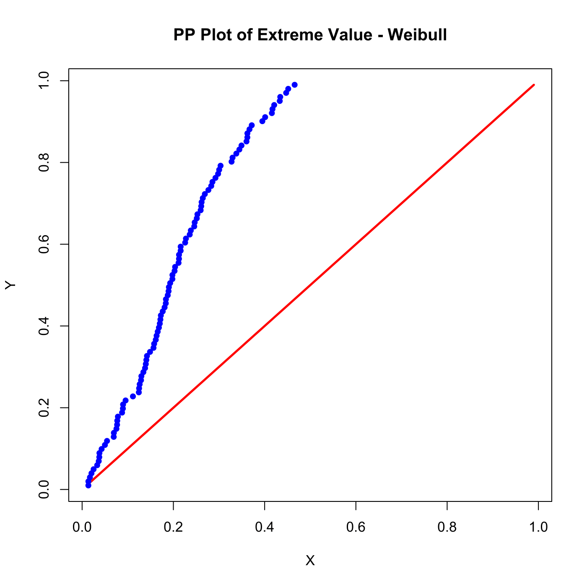
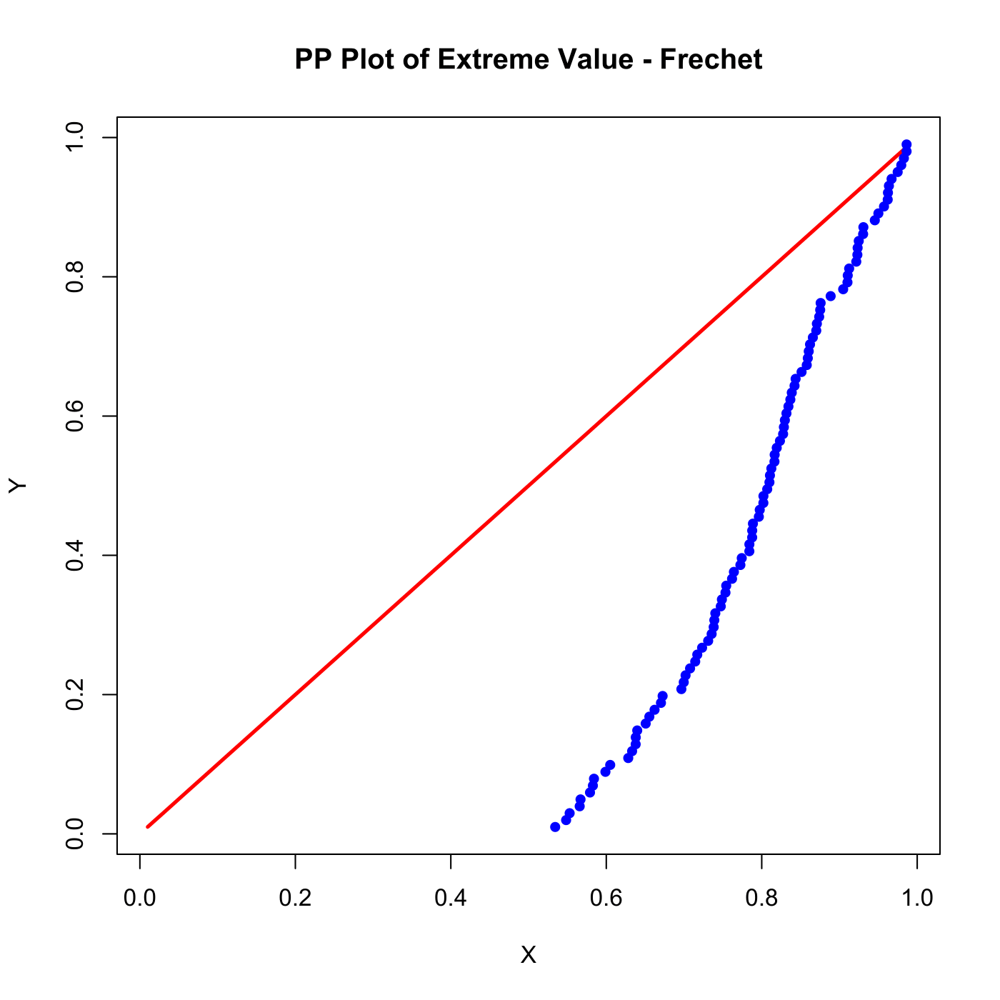

##  **SFEevt2**

```yaml
Name of QuantLet : SFEevt2 
Published in: Statistics of Financial Markets
Description: 'Shows the normal probability plot (PP Plot) of the pseudo random variables with extreme value distributions: Weibull, Frechet and Gumbel.'
Keywords:
- Frechet
- GEV
- Weibull
- distribution
- edf
- extreme-value
- gumbel
- normal
- normal-distribution
- plot
- pp-plot
- random
- random-number-generation
See also:
- SFEevt1
- SFEevt3
Author: Wolfgang K. Härdle
Submitted: Fri, June 05 2015 by Lukas Borke
Input: n - number of observations
Output: 'Normal plot of the pseudo random variables with Weibull, Frechet and Gumbel distributions.'
Example: 'User inputs the number of observations like 100, then 3 PP Plots of the random distributions are given via the interactive selection menu. The PP line shows the difference of the distributions.'
```






```r

# clear variables and close windows
rm(list = ls(all = TRUE))
graphics.off()

# install and load packages
# user should install 'fExtremes' package for the Gumbel distribution
libraries = c("fExtremes")
lapply(libraries, function(x) if (!(x %in% installed.packages())) {install.packages(x)} )
lapply(libraries, library, quietly = TRUE, character.only = TRUE)

# fix pseudo random numbers for reproducibility
set.seed(20080605)

# interactive selection menu
selitem = c("Weibull", "Frechet", "Gumbel")
sel = select.list(selitem, title = "Please choose")

# global parameter settings
n = 100
y = (1:n)/(n + 1)

# Weibull
if (sel == "Weibull") {
    x = -rweibull(100, 2, scale = 1)
    x = sort(x)
    quantile = pnorm(x)
    plot(y, y, col = "red", type = "line", lwd = 2.5, main = "PP Plot of Extreme Value - Weibull", 
        xlab = "X", ylab = "Y", xaxt = "n", yaxt = "n")
    axis(1, at = seq(0, 1, 0.2))
    axis(2, at = seq(0, 1, 0.2))
    points(quantile, y, col = "blue", pch = 19, cex = 0.8)
}

# Frechet
if (sel == "Frechet") {
    x = rweibull(100, 2, scale = 1)
    x = sort(x)
    quantile = pnorm(x)
    plot(y, y, col = "red", type = "line", lwd = 2.5, main = "PP Plot of Extreme Value - Frechet", 
        xlab = "X", ylab = "Y", xaxt = "n", yaxt = "n")
    axis(1, at = seq(0, 1, 0.2))
    axis(2, at = seq(0, 1, 0.2))
    points(quantile, y, col = "blue", pch = 19, cex = 0.8)
}

# Gumbel
if (sel == "Gumbel") {
    x = rnorm(100)
    gumbel = exp(-2.7182^(-x))
    gumbel = sort(gumbel)
    mu = 0
    sigma = 1
    s = rgev(100, 0, mu, sigma)
    s = sort(s)
    quantile = pnorm(s)
    plot(y, y, col = "red", type = "l", lwd = 2.5, main = "PP Plot of Extreme Value - Gumbel", 
        xlab = "X", ylab = "Y", xaxt = "n", yaxt = "n")
    axis(1, at = seq(0, 1, 0.2))
    axis(2, at = seq(0, 1, 0.2))
    points(quantile, y, col = "blue", pch = 19, cex = 0.8)
} 

```
