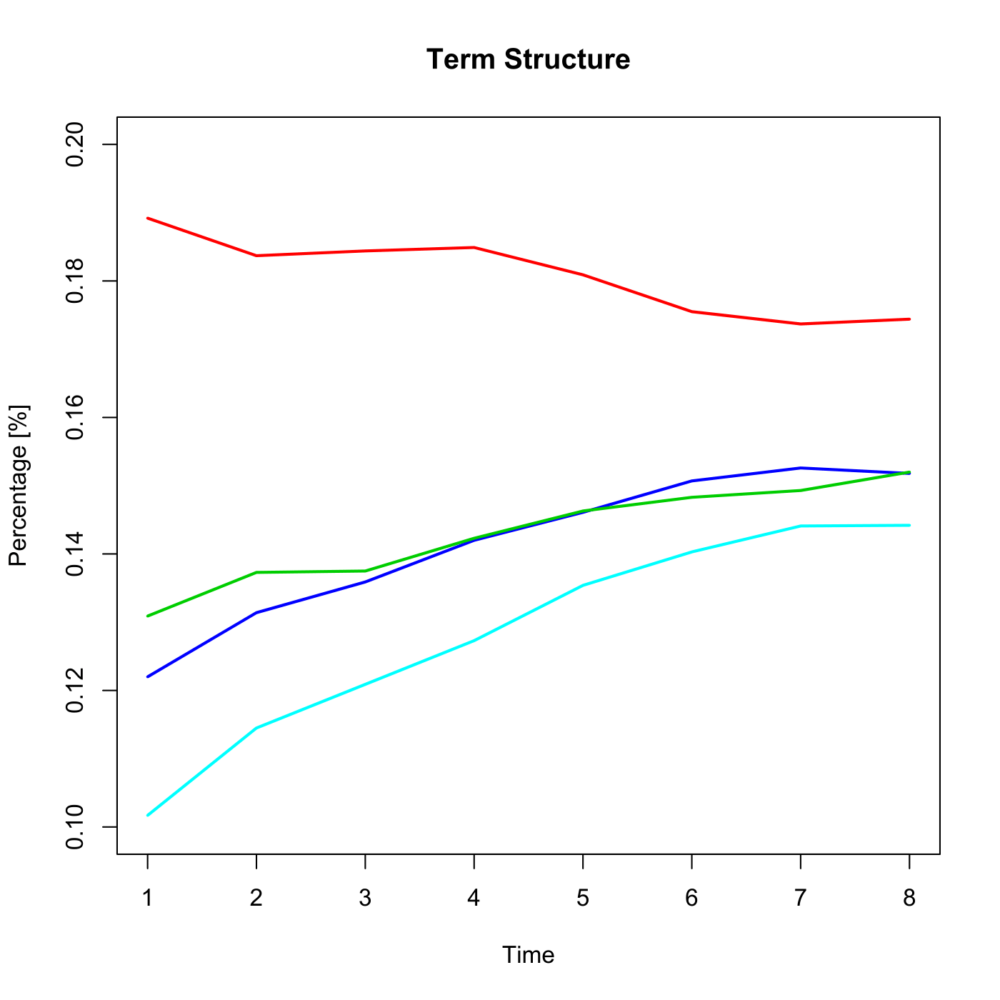
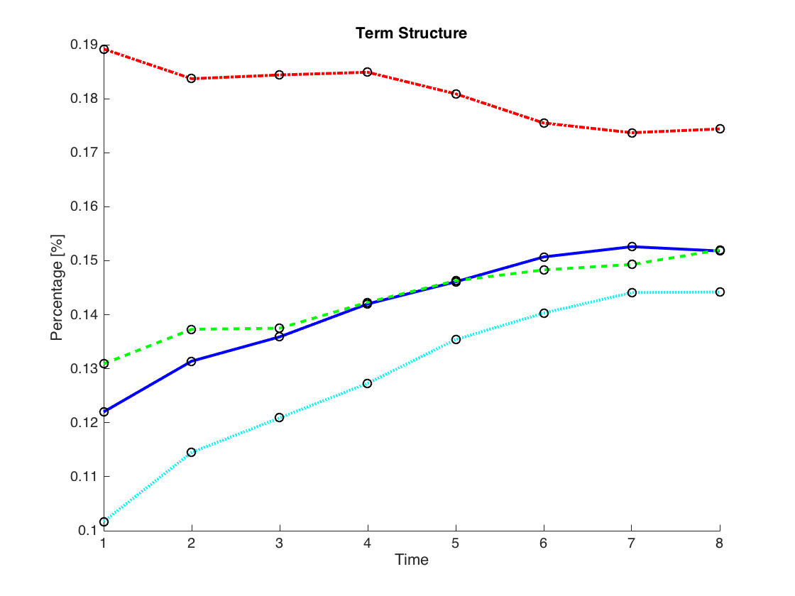

[](http://quantlet.de/index.php?p=info)

## [](http://quantlet.de/) **SFEVolaTermStructure** [](http://quantlet.de/d3/ia)

```yaml

Name of QuantLet : SFEVolaTermStructure

Published in : Statistics of Financial Markets

Description : 'Shows an intersection of the implied volatility surface, illustrates time to
maturity structure of implied DAX volatilities at the money.'

Keywords : 'atm, black-scholes, dax, financial, implied-volatility, index, option, surface, term
structure, vdax, volatility'

See also : SFEVolSurfPlot, SFEVolSurfPlot, SFEVolaCov, SFEVolaPCA

Author : Joanna Tomanek

Author[Matlab] : Wolfgang K. Härdle

Submitted : Fri, June 05 2015 by Lukas Borke

Submitted[Matlab] : Thu, February 04 2010 by Lasse Groth

Datafiles : implvola.dat

Example : Time to maturity structure of implied DAX volatilities at the money.

```






### R Code:
```r

# clear variables and close windows
rm(list = ls(all = TRUE))
graphics.off()

# load data
x = read.table("implvola.dat")

# rescale
x = x/100

dat1 = cbind(c(1:8), t(x[11, ]))
dat2 = cbind(c(1:8), t(x[31, ]))
dat3 = cbind(c(1:8), t(x[111, ]))
dat4 = cbind(c(1:8), t(x[231, ]))

a = seq(0.12, to = 0.19, length.out = 8)
plot(a, type = "n", main = "Term Structure", xlab = "Time", ylab = "Percentage [%]", ylim = c(0.1, 0.2))
lines(dat1, col = 4, type = "l", lwd = 2)
lines(dat2, col = 3, type = "l", lwd = 2)
lines(dat3, col = 5, type = "l", lwd = 2)
lines(dat4, col = 2, type = "l", lwd = 2) 

```

### MATLAB Code:
```matlab
clear
clc
close all

%Load data
x = load('implvola.dat');
x = x / 100;

dat1=[[1:8]; x(11, :)];
dat2=[[1:8]; x(31, :)];
dat3=[[1:8]; x(111, :)];
dat4=[[1:8]; x(231, :)];

%Plot different term structures of the implied volatility.
hold on

plot(dat1(1,:), dat1(2,:), 'Color','b', 'LineWidth', 2, 'LineStyle', '-')
plot(dat2(1,:), dat2(2,:), 'Color','g', 'LineWidth', 2, 'LineStyle', '--')
plot(dat3(1,:), dat3(2,:), 'Color','c', 'LineWidth', 2, 'LineStyle', ':')
plot(dat4(1,:), dat4(2,:), 'Color','r', 'LineWidth', 2, 'LineStyle', '-.')

scatter(dat1(1,:), dat1(2,:), 'k')
scatter(dat2(1,:), dat2(2,:), 'k')
scatter(dat3(1,:), dat3(2,:), 'k')
scatter(dat4(1,:), dat4(2,:), 'k')

hold off

title('Term Structure')
xlabel('Time')
ylabel('Percentage [%]')
```
