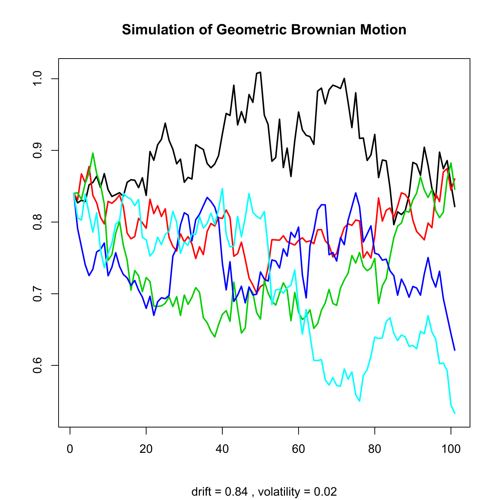

##  **SFEsimGBM**

```yaml
Name of QuantLet : SFEsimGBM
Published in: Statistics of Financial Markets
Description: 'Simulates and plots a path of a geometric Brownian motion (GBM) using 4 different methods: direct integration, Euler scheme, Milstein scheme, second order Milstein scheme.'
Keywords:
- Euler
- brownian-motion
- direct integration
- discrete
- geometric-brownian-motion
- graphical representation
- normal-distribution
- plot
- process
- random-number-generation
- simulation
- stochastic
- stochastic-process
- wiener-process
See also:
- SFEGBMProcess
- SFEsimCIR
Author:
- Rafal Weron
- Awdesch Melzer
Submitted: Mon, June 08 2015 by Lukas Borke
Example: Plots 5 paths of a geometric Brownian motion using the Euler scheme.
```




```r

# clear variables and close windows
rm(list = ls(all = TRUE))
graphics.off()

# simulation routine
# simGBM returns a vector of a sample trajectory of Geometric Brownian Motion on the time interval [0,N]
simGBM = function(n, x0, mu, sigma, delta, no, method) {
    # Set default value
    if (missing(method)) {
        method = 0  # direct integration
    }
    # Generate normal random numbers if not provided in 'no'
    if (missing(no)) {
        no = rnorm(ceiling(n/delta), 0, 1)
    # Check whether length of 'no' is appropriate
    } else {
        no = no
        if (length(no) != ceiling(n/delta)) {
            stop("Error: length(no) <> n/delta")
        }
    }
    if (method == 1) {
        # Euler scheme
        x = x0 * cumprod(1 + mu * delta + sigma * delta^0.5 * no)
    } else if (method == 2) {
        # Milstein scheme
        x = x0 * cumprod(1 + mu * delta + sigma * delta^0.5 * no + 0.5 * sigma^2 * 
            delta * (no^2 - 1))
    } else if (method == 3) {
        # 2nd order Milstein scheme
        x = x0 * cumprod(1 + mu * delta + sigma * delta^0.5 * no + 0.5 * sigma^2 * 
            delta * (no^2 - 1) + mu * sigma * no * (delta^1.5) + 0.5 * (mu^2) *  (delta^2))
    } else {
        # Direct integration
        x = x0 * exp(cumsum((mu - 0.5 * sigma^2) * delta + sigma * delta^0.5 * no))
    }
    # Add starting value
    x = c(x0, x)
}

set.seed(100)
# parameter settings
step = 100    # number of steps of the motion
k    = 5      # number of trajectories
mu   = 0.84
sig  = 0.02

path = matrix(0, step + 1, k)
for (i in 1:k) {
    path[, i] = simGBM(1, mu, sig, sqrt(0.1), 1/100, rnorm(step, 0, 1), 1)
}

# plot
plot(path[, 1], col = 1, lwd = 2, ylab = "", xlab = "", type = "l", ylim = c(min(path), 
    max(path)), sub = paste("drift =", mu, ", volatility =", sig))
title(paste("Simulation of Geometric Brownian Motion"))
for (i in 2:k) {
    lines(path[, i], col = i, lwd = 2)
} 

```
