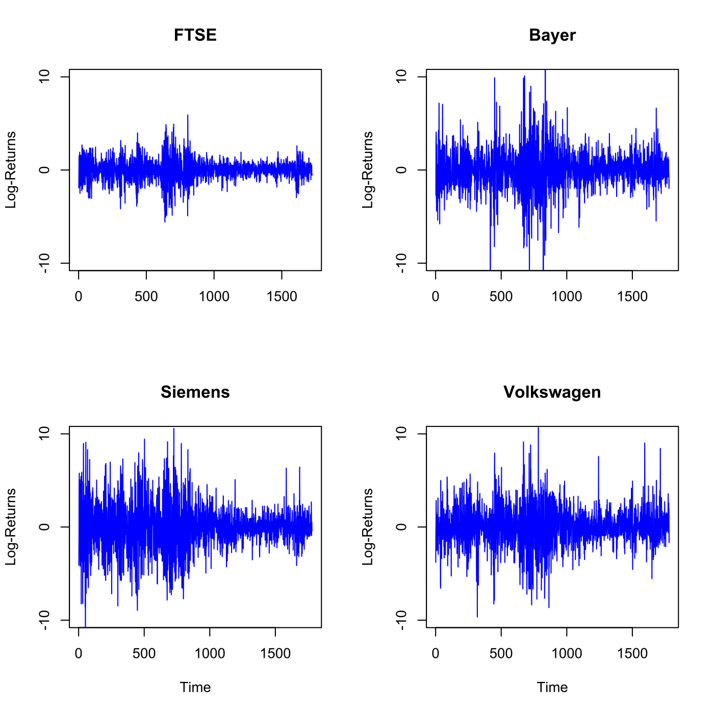

##  **SFEcomplogreturns**

```yaml
Name of QuantLet : SFEcomplogreturns 
Published in: Statistics of Financial Markets
Description: 'Plots daily log returns of FTSE 100 and DAX stocks (Bayer, Siemens and Volkswagen), for the period 3 January 2000 - 30 October 2006.'
Keywords:
- asset
- data visualization
- dax
- descriptive-statistics
- financial
- ftse100
- graphical representation
- index
- log-returns
- plot
- returns
- stock-price
- time-series
See also:
- SFEfdescStat
- SFEfdescStat
Author: Awdesch Melzer
Submitted: Wed, June 10 2015 by Lukas Borke
Datafiles:
- BAYERlevel(03.01.00-30.10.06).txt
- FTSElevel(03.01.00-30.10.06).txt
- SIEMENSlevel(03.01.00-30.10.06).txt
- VWlevel(03.01.00-30.10.06).txt
```




```r

# clear variables and close windows
rm(list = ls(all = TRUE))
graphics.off()

# load the data
x1 = read.table("FTSElevel(03.01.00-30.10.06).txt")
x2 = read.table("BAYERlevel(03.01.00-30.10.06).txt")
x3 = read.table("SIEMENSlevel(03.01.00-30.10.06).txt")
x4 = read.table("VWlevel(03.01.00-30.10.06).txt")

# calculating log returns
x1 = diff(log(x1[, 1]))
n1 = length(x1)
x2 = diff(log(x2[, 1]))
n2 = length(x2)
x3 = diff(log(x3[, 1]))
n3 = length(x3)
x4 = diff(log(x4[, 1]))
n4 = length(x4)

# 4 Plots for 4 data sets
par(mfrow = c(2, 2))

plot(x1, ylim = c(-0.1, 0.1), main = "FTSE", type = "l", col = "blue", xlab = "", 
    ylab = "Log-Returns", axes = FALSE, frame = TRUE)
axis(side = 1, at = seq(0, n1, 500), labels = seq(0, n1, 500))
axis(side = 2, at = seq(-0.1, 0.1, 0.1), labels = seq(-10, 10, 10))

plot(x2, ylim = c(-0.1, 0.1), main = "Bayer", type = "l", col = "blue", xlab = "", 
    ylab = "Log-Returns", axes = FALSE, frame = TRUE)
axis(side = 1, at = seq(0, n2, 500), labels = seq(0, n2, 500))
axis(side = 2, at = seq(-0.1, 0.1, 0.1), labels = seq(-10, 10, 10))

plot(x3, ylim = c(-0.1, 0.1), main = "Siemens", type = "l", col = "blue", xlab = "Time", 
    ylab = "Log-Returns", axes = FALSE, frame = TRUE)
axis(side = 1, at = seq(0, n3, 500), labels = seq(0, n3, 500))
axis(side = 2, at = seq(-0.1, 0.1, 0.1), labels = seq(-10, 10, 10))

plot(x4, ylim = c(-0.1, 0.1), main = "Volkswagen", type = "l", col = "blue", 
    xlab = "Time", ylab = "Log-Returns", axes = FALSE, frame = TRUE)
axis(side = 1, at = seq(0, n4, 500), labels = seq(0, n4, 500))
axis(side = 2, at = seq(-0.1, 0.1, 0.1), labels = seq(-10, 10, 10)) 

```
