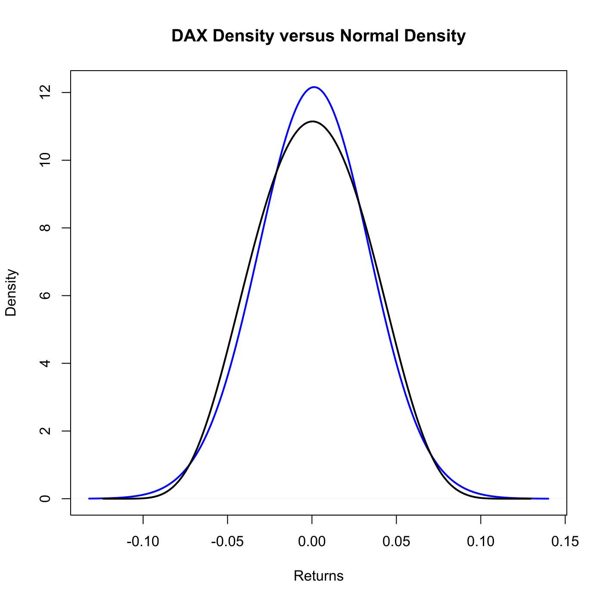

##  **SFEDaxReturnDistribution**

```yaml
Name of QuantLet : SFEDaxReturnDistribution
Published in: Statistics of Financial Markets
Description: 'Compares a kernel estimation of the density of DAX returns distribution with a kernel estimation of a normal distribution with the same mean and variance. The data is taken from the Xetra-DAX 1999.'
Keywords:
- data visualization
- dax
- density
- distribution
- estimation
- financial
- graphical representation
- kernel
- log-returns
- normal
- normal-distribution
- plot
- random-number-generation
- returns
See also: MMSTATdistribution_normal
Author: Joanna Tomanek
Submitted: Fri, June 12 2015 by Lukas Borke
Datafiles: dax99.dat
Example: DAX Density (blue) versus Normal Density (black)
```




```r

# clear variables and close windows
rm(list = ls(all = TRUE))
graphics.off()

# load data
data  = read.table("dax99.dat")
dax99 = data[, 2]                   # first line is date, second XetraDAX 1999
ret   = diff(log(dax99))
fh    = density(ret, bw = 0.03)     # estimate Dax return density

mu = mean(ret)                      # empirical mean
si = sqrt(var(ret))                 # empirical standard deviation (std)
x  = si * rnorm(400) + mu           # generate artificial data from the same mean and std
f  = density(x, bw = 0.03, kernel = "biweight") # estimate its density

# plot
plot(fh, col = "blue", lwd = 2, main = "DAX Density versus Normal Density", xlab = "Returns", ylab = "Density")
lines(f, lwd = 2, col = "black") 

```
