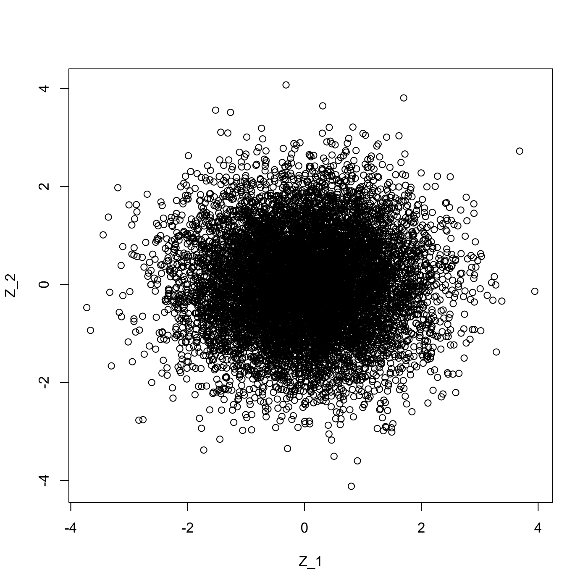
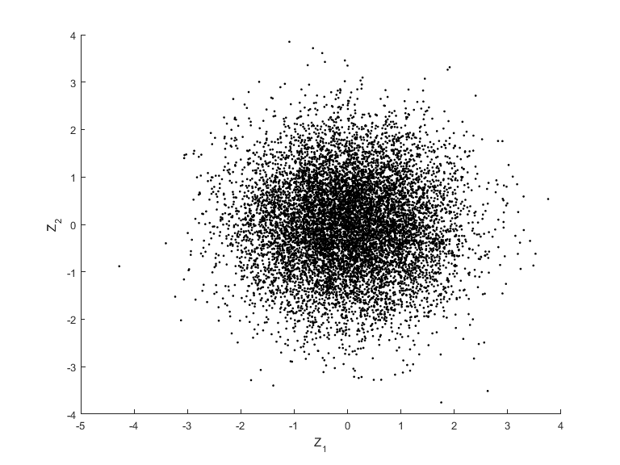

[](http://quantlet.de/index.php?p=info)

## [](http://quantlet.de/) **SFEBMuller** [](http://quantlet.de/d3/ia)

```yaml

Name of QuantLet : SFEBMuller

Published in : Statistics of Financial Markets

Description : 'Transforms uniformly distributed random variables to sets of independent standard
normally distributed random numbers using the Box Muller algorithm.'

Keywords : 'box-muller, distribution, graphical representation, normal-distribution, plot, random,
random-number-generation, scatterplot, standard, standard-normal, uniform'

Author : Brenda López Cabrera

Submitted : Thu, July 16 2015 by quantomas

Submitted[Matlab] : Tue, May 17 2016 by Christoph Schult

Example : 'The scatterplot of two sets of independent standard normally distributed random numbers
is displayed and the mean and variance are calculated for two distributions, each containing
n=10000 elements.'

```






### R Code:
```r
# clear variables and close windows
rm(list = ls(all = TRUE))
graphics.off()

# main computation
n      = 10000
u      = runif(n, 0, 1)
u1     = runif(n, 0, 1)
theta  = 2 * pi * u1
rho    = sqrt(-2 * log(u))
zeta1  = rho * cos(theta)
zeta2  = rho * sin(theta)
result = cbind(zeta1, zeta2)

# output
plot(result[, 1], result[, 2], xlab = "Z_1", ylab = "Z_2")

v1 = var(result[, 1])
v2 = var(result[, 2])
m1 = mean(result[, 1])
m2 = mean(result[, 2])

print("    Normal distribution 1")
print("    Mean      Variance")
print(c(m1, v1))
print("    Normal distribution 2")
print("    Mean      Variance")
print(c(m2, v2))

```

### MATLAB Code:
```matlab
clear all
close all
clc

% main computation
n      = 10000;
u      = unifrnd(0, 1, [10000, 1]);
u1     = unifrnd(0, 1, [10000, 1]);
theta  = 2 * pi * u1;
rho    = sqrt(-2 * log(u));
zeta1  = rho .* cos(theta);
zeta2  = rho .* sin(theta);
result = [zeta1 zeta2];

% create scatterplot
scatter(result(:, 1), result(:, 2), '.', 'k')
xlabel('Z_1')
ylabel('Z_2')

% define parameters of the distributions to display
v1 = var(result(:, 1));
v2 = var(result(:, 2));
m1 = mean(result(:, 1));
m2 = mean(result(:, 2));

% display parameters
disp('    Normal distribution 1')
disp('    Mean      Variance')
disp([m1 v1])
disp('    Normal distribution 2')
disp('    Mean      Variance')
disp([m2 v2])

```
