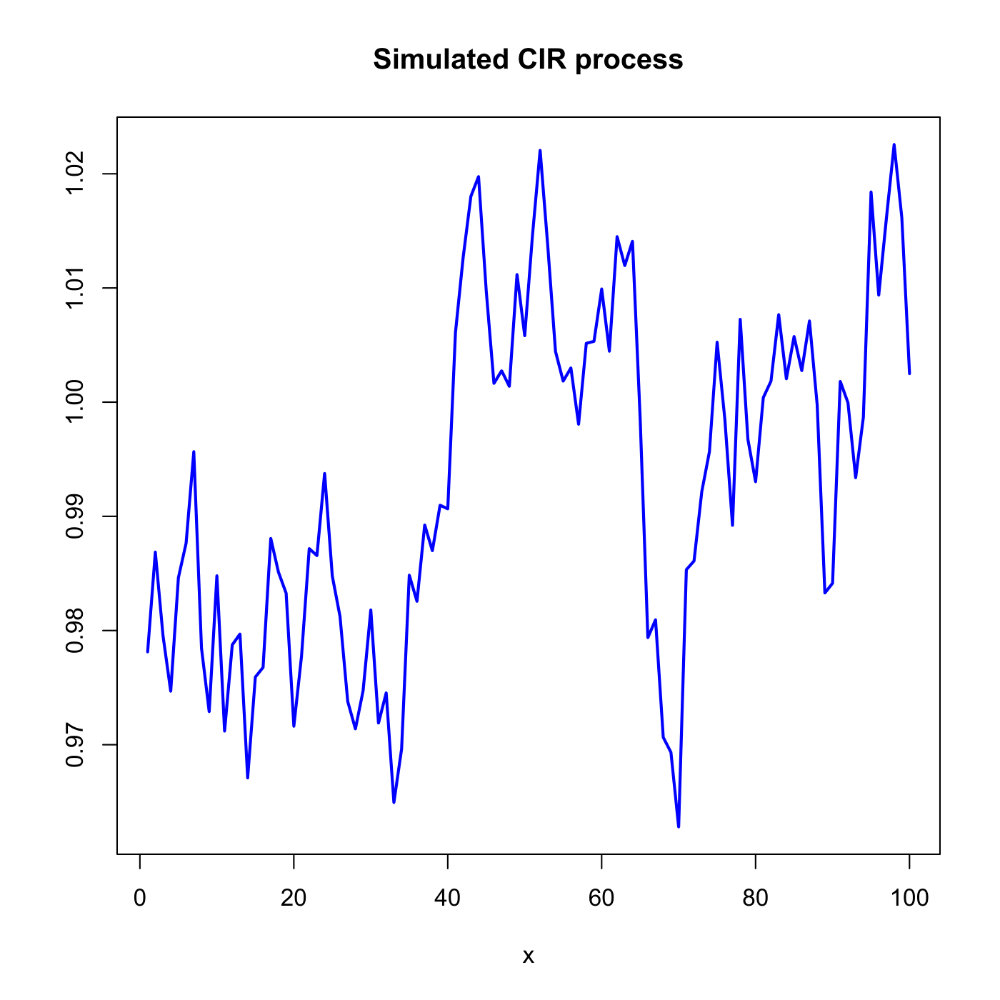

[](http://quantlet.de/index.php?p=info)

## [](http://quantlet.de/) **SFEsimCIR** [](http://quantlet.de/d3/ia)

```yaml

Name of QuantLet : SFEsimCIR

Published in : Statistics of Financial Markets

Description : Simulates and plots a path of a Cox-Ingersoll-Ross (CIR) process.

Keywords : 'cir, graphical representation, interest-rate, plot, process, simulation, stochastic,
stochastic-process'

See also : SFEscomCIR, SFEscomCIR, SFEsimCIR2

Author : Awdesch Melzer

Submitted : Fri, July 17 2015 by quantomas

Input: 
- FALSE: Number of Observations
- beta: Parameter
- gamma: Parameter
- m: Mean

Output : Plot of a simulated CIR process

Example : 'User inputs the parameters [number of observations, beta, gamma, mean] like [100, 0.1,
0.01, 1], then plot of a simulated CIR process is given.'

```




```r
rm(list = ls(all = TRUE))
graphics.off()

# user inputs parameters
print("Please input # of observations n, beta, gamma, mean m  ")
print("after 1. input the following, for example:  100 0.1 0.01 1")
print("then press enter two times")
para = scan()

while (length(para) < 4) {
    print("Not enough input arguments. Please input in 1*4 vector form like [100 0.1 0.01 1] or [100 0.1 0.01 1]")
    print("[# of observations, beta, gamma, mean]=")
    para = scan()
}
n     = para[1]
beta  = para[2]
gamma = para[3]
m     = para[4]

# simulates a mean reverting square root process around m
i     = 0
delta = 0.1
x     = m          # start value
while (i < (n * 10)) {
    i = i + 1
    d = beta * (m - x[length(x)]) * delta + gamma * sqrt(delta * abs(x[length(x)])) * rnorm(1, mean = 0, sd = 1)
    x = rbind(x, x[length(x)] + d)
}
x = x[2:length(x)]
x = x[10 * seq(1, n)]

# plot
plot(x, main = "Simulated CIR process", xlab = "x", ylab = "", type = "l", col = "blue", lwd = 2)
```
