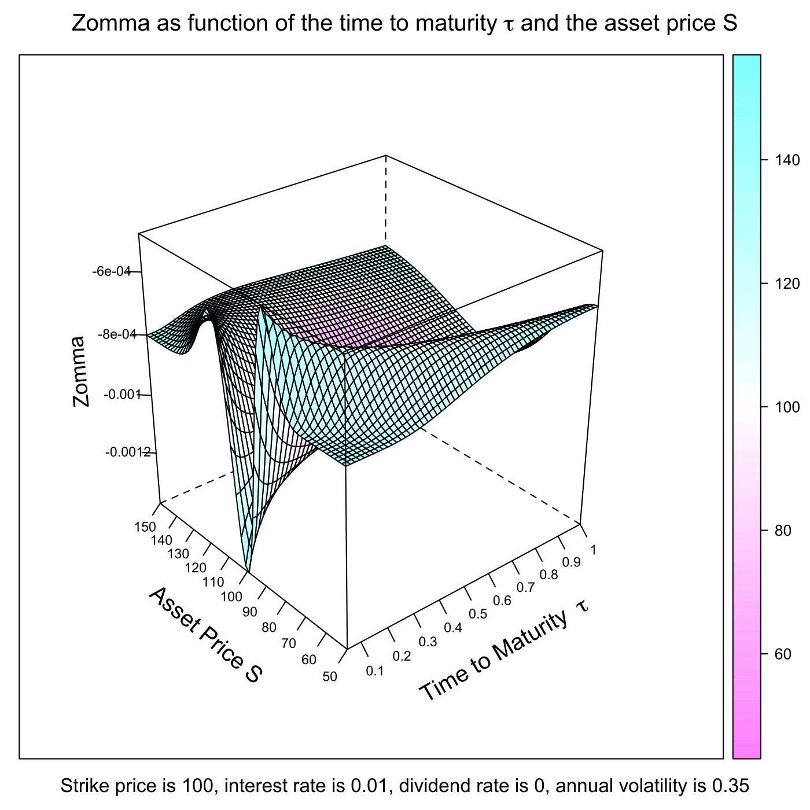

##  **SFEzomma**

```yaml
Name of QuantLet : SFEzomma 
Published in: Statistics of Financial Markets
Description: 'Plots the Zomma of a call/put option. Zomma is divided by 100 to reflect a one-percentage point change in volatility.'
Keywords:
- asset
- black-scholes
- call
- financial
- graphical representation
- greeks
- option
- option-price
- plot
- put
- returns
- stock-price
- volatility
Author:
- Andreas Golle
- Awdesch Melzer
Submitted: Sat, July 18 2015 by quantomas
Example: 'User inputs [lower, upper] bound of Asset price S like [50,150], [lower, upper] bound of time to maturity tau like [0.05, 1], then plot of the Zomma of a call option is given.'
```




```r
# clear variables and close windows
rm(list = ls(all = TRUE))
graphics.off()

# install and load packages
libraries = c("lattice")
lapply(libraries, function(x) if (!(x %in% installed.packages())) {install.packages(x)} )
lapply(libraries, library, quietly = TRUE, character.only = TRUE)

# parameter settings
s1    = 50      # lower bound of Asset Price
s2    = 150     # upper bound of Asset Price 
t1    = 0.05    # lower bound of Time to Maturity
t2    = 1       # upper bound of Time to Maturity
K     = 100     # exercise price 
r     = 0.01    # interest rate
sig   = 0.35    # volatility
d     = 0       # dividend rate
b     = r - d   # cost of carry
steps = 60

meshgrid = function(a, b) {
    list(x = outer(b * 0, a, FUN = "+"), y = outer(b, a * 0, FUN = "+"))
}

first = meshgrid(seq(t1, t2, -(t1 - t2)/(steps - 1)), seq(t1, t2, -(t1 - t2)/(steps - 1)))

tau  = first$x
dump = first$y

second = meshgrid(seq(s1, s2, -(s1 - s2)/(steps - 1)), seq(s1, s2, -(s1 - s2)/(steps - 1)))

dump2 = second$x
S     = second$y

# Black Scholes
d1 = (log(S/K) + (r - d + sig^2/2) * tau)/(sig * sqrt(tau))
d2 = d1 - sig * sqrt(tau)
# Greeks
gamma = dnorm(d1)/(S * (sig * sqrt(tau)))
zomma = gamma * ((d1 * d2 - 1)/sig)

# Plot
title = bquote(expression(paste("Strike price is ", .(K), ", interest rate is ", 
    .(r), ", dividend rate is ", .(d), ", annual volatility is ", .(sig))))

wireframe((zomma/100) ~ tau * S, drape = T, ticktype = "detailed", main = expression(paste("Zomma as function of the time to maturity ", 
    tau, " and the asset price S")), sub = title, scales = list(arrows = FALSE, 
    col = "black", distance = 1, tick.number = 8, cex = 0.7, x = list(labels = round(seq(t1, 
        t2, length = 11), 1)), y = list(labels = round(seq(s1, s2, length = 11), 
        1)), z = list(labels = round(seq(min(zomma/100), max(zomma/100), length = 11), 
        4))), xlab = list(expression(paste("Time to Maturity  ", tau)), rot = 30, 
    cex = 1.2), ylab = list("Asset Price S", rot = -40, cex = 1.2), zlab = list("Zomma", 
    rot = 95, cex = 1.1)) 
```
