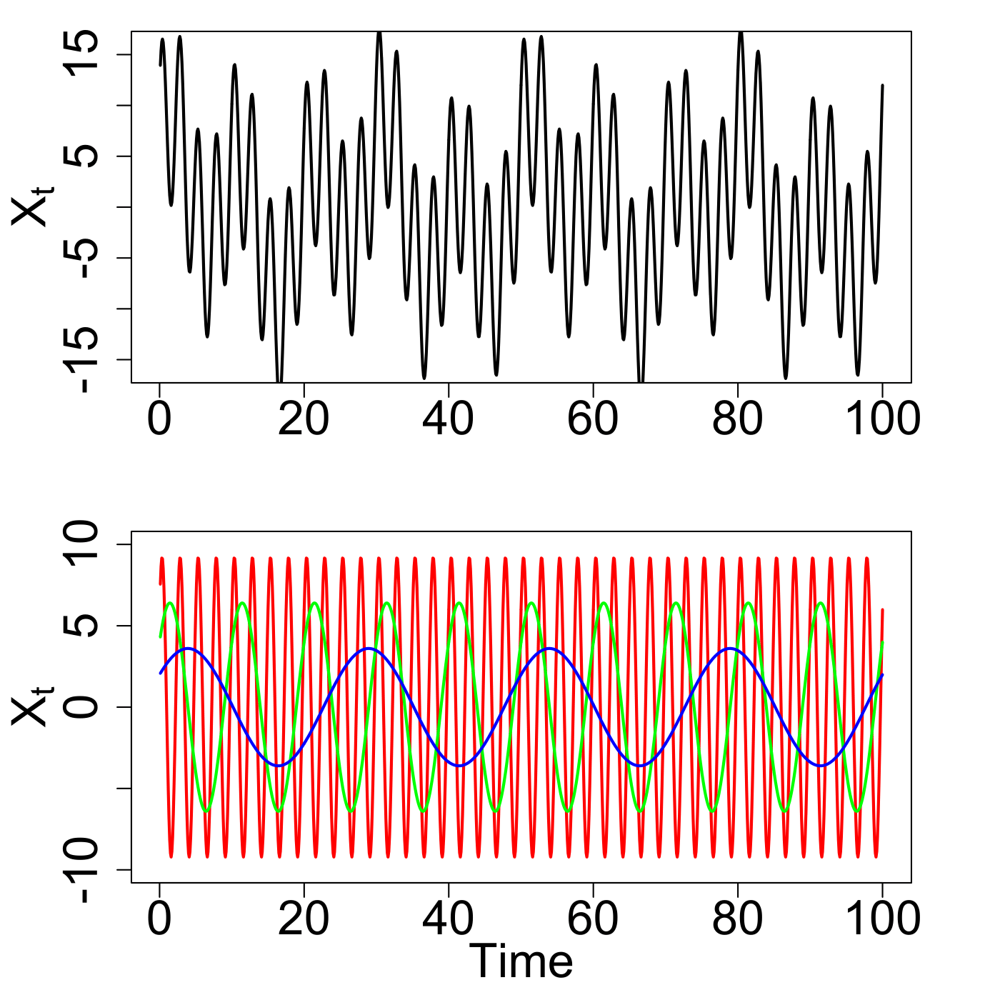

##  **SFETsDecomp**

```yaml
Name of QuantLet : SFETsDecomp 
Published in: Statistics of Financial Markets
Description: 'Computes plots showing the decomposition of a time series into sinusoids with frequencies f={0.4, 0.1, 0.04}.'
Keywords: decomposition, graphical representation, plot, sinusoids, time-series
Author: Franziska Schulz, Elisabeth Bommes, Caroline Kleist
Submitted: Wed, July 22 2015 by quantomas
```




```r
# clear variables and close windows
rm(list = ls(all = TRUE))
graphics.off()

# Main computation
t  = c(1:1000)/10
x1 = 2 * cos(2 * pi * t * 4/100) + 3 * sin(2 * pi * t * 4/100)
x2 = 4 * cos(2 * pi * t * 10/100) + 5 * sin(2 * pi * t * 10/100)
x3 = 6 * cos(2 * pi * t * 40/100) + 7 * sin(2 * pi * t * 40/100)
x  = x1 + x2 + x3

# Plots
par(mfrow = c(2, 1), mar = c(4, 4.5, 1, 3) + 0.1, mgp = c(2.5, 1, 0))
plot(t, x, ylab = expression(X[t]), xlab = "", cex.axis = 2, cex.lab = 2, type = "l", 
    lwd = 2, ylim = c(-16, 16))
plot(t, x3, ylab = expression(X[t]), xlab = "Time", cex.axis = 2, cex.lab = 2, type = "l", 
    col = "red", lwd = 2, ylim = c(-10, 10))
lines(t, x2, col = "green", lwd = 2)
lines(t, x1, col = "blue", lwd = 2) 
```
