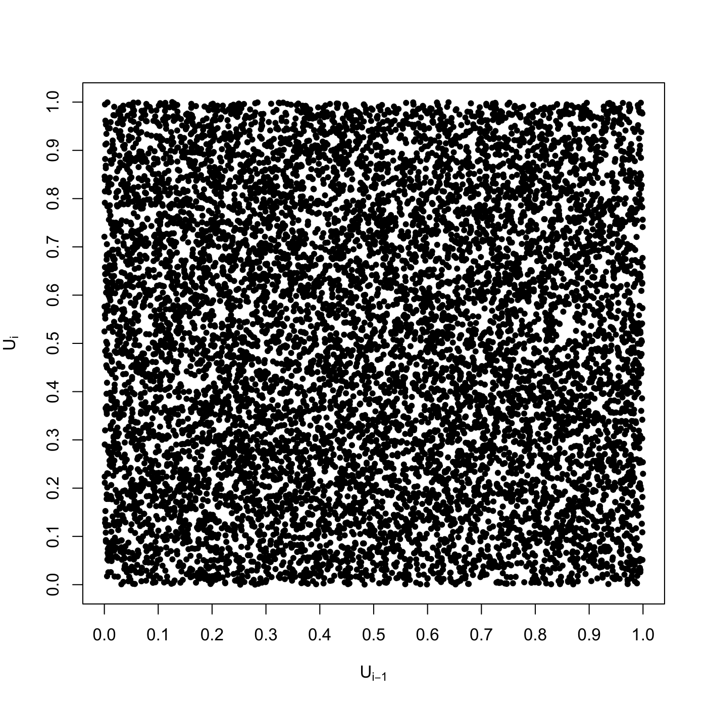

##  **SFEfibonacci**

```yaml
Name of QuantLet : SFEfibonacci 
Published in: Statistics of Financial Markets
Description: 'Generates uniform random numbers using Fibonacci Algorithm and produces a plot of generated numbers.'
Keywords: Fibonacci, graphical representation, plot, random, random-number-generation, scatterplot, simulation, uniform
See also: SFErandu, SFErangen1, SFErangen2
Author: Wolfgang K. Haerdle
Submitted: Wed, July 22 2015 by quantomas
Example: 'A plot is generated for the following parameter values: a=1366, b=150889, M=714025, n=10000.'
```




```r
# clear variables and close windows
rm(list = ls(all = TRUE))
graphics.off()

# parameter settings
nn   = 18
a    = 1366
b    = 150889
M    = 714025
seed = 1234567
n    = 10000
yy   = c(seed)
i    = 2

# Main computation
while (i <= nn) {
    yy = cbind(yy, ((a * yy[i - 1] + b)%%M))
    i  = i + 1
}
y = yy/M
i = 19

while (i <= n + 18) {
    zeta = y[i - 17] - y[i - 5]
    if (zeta < 0) {
        zeta = zeta + 1
    }
    y[i] = zeta
    i = i + 1
}
y   = y[19:n + 18]
n1  = n - 2
n2  = n - 1
dat = c(y[1:n1], y[2:n2])

# Plot
plot(y[1:n1], y[2:n2], type = "p", pch = 20, xlab = expression(U[i - 1]), ylab = expression(U[i]), 
    xaxp = c(0, 1, 10), yaxp = c(0, 1, 10), xlim = c(0, 1), ylim = c(0, 1))

```
