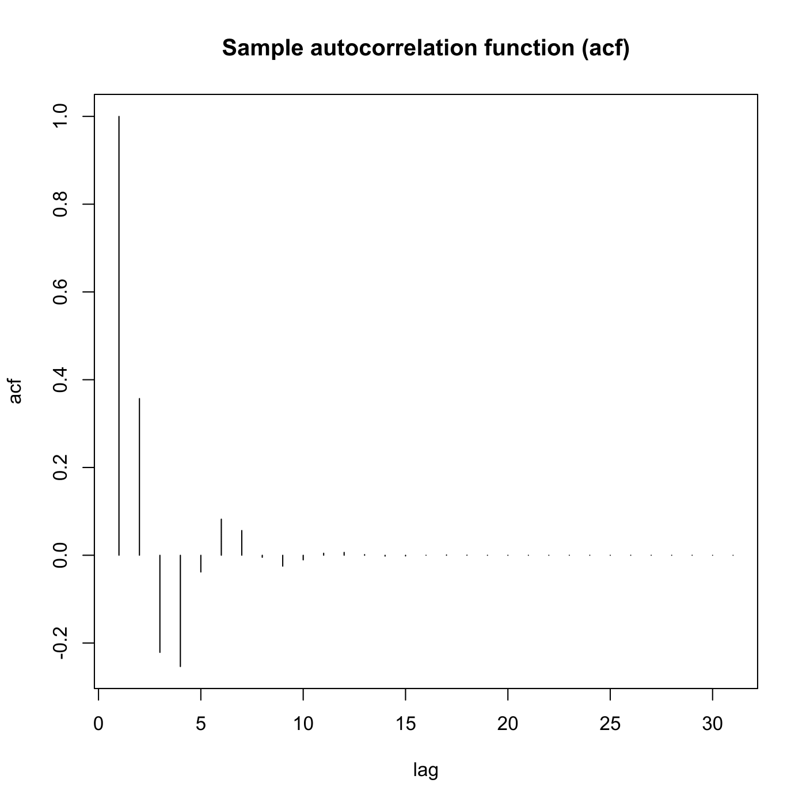
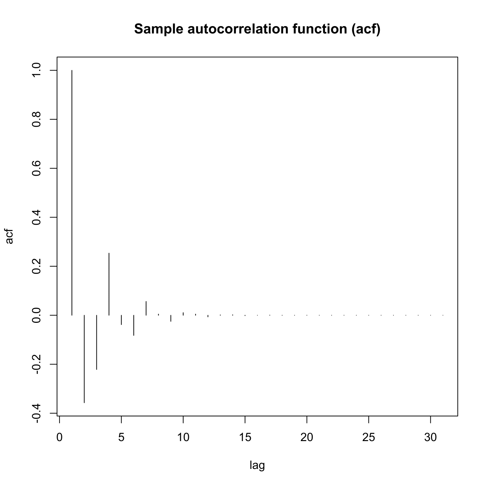

##  **SFEacfar2**

```yaml
Name of QuantLet : SFEacfar2 
Published in: Statistics of Financial Markets
Description: Plots the autocorrelation function of an AR(2) (autoregressive) process.
Keywords:
- acf
- autocorrelation
- autoregressive
- discrete
- graphical representation
- linear
- plot
- process
- simulation
- stationary
- stochastic
- stochastic-process
- time-series
See also:
- SFEacfar1
- SFEacfma1
- SFEacfma2
- SFElikma1
- SFEpacfar2
- SFEpacfma2
- SFEplotma1
Author: Joanna Tomanek
Submitted: Fri, July 24 2015 by quantomas
Input:
- lag - lag value
- a1 - alpha_1
- a2 - alpha_2
Example:
- a1=0.5, a2=0.4 and lag=30
- a1=0.5, a2=-0.4 and lag=30.
- a1=-0.5, a2=0.4 and lag=30.
- a1=-0.5, a2=-0.4 and lag=30.

```








```r
# clear variables and close windows
rm(list = ls(all = TRUE))
graphics.off()

# parameter settings
lag = "30"  	# lag value
a1  = "0.5"  	# value of alpha_1
a2  = "0.4"  	# value of alpha_2

# Input alpha1
message = "input alpha1"
default = a1
a1      = winDialogString(message, default)
a1      = type.convert(a1, na.strings = "NA", as.is = FALSE, dec = ".")

# Input alpha2
message = "input alpha2"
default = a2
a2      = winDialogString(message, default)
a2      = type.convert(a2, na.strings = "NA", as.is = FALSE, dec = ".")

# Input lag
message = "input lag"
default = lag
lag     = winDialogString(message, default)
lag     = type.convert(lag, na.strings = "NA", as.is = FALSE, dec = ".")

# Plot ACF with alpha_1=a1, alpha_2=a2
plot(ARMAacf(ar = c(a1, a2), ma = numeric(0), lag.max = lag, pacf = FALSE), type = "h", 
    xlab = "lag", ylab = "acf")
title("Sample autocorrelation function (acf)") 

```
