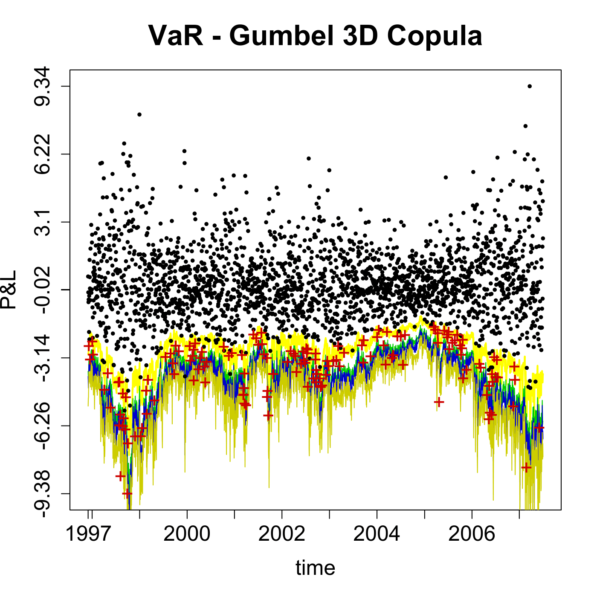

##  **SFEVaRHAC**

```yaml
Name of QuantLet : SFEVaRHAC 
Published in: Statistics of Financial Markets
Description: 'According to the VaR methodology the profit and loss (P&L) is plotted against the time. The dots represent the empirical P&L stated by the data. The four curves under the dots correspond to the lower 5% (yellow), 1% (green), 0.5% (blue) and 0.1% (dark yellow) quantiles of the a estimated Gumbel-copula.'
Keywords: VaR, copula, data visualization, forecast, graphical representation, gumbel, plot, quantile, time-series, visualization
See also: SFEVaRcopulaSIM2ptv, SFScontourgumbel, SFScontourgumbel
Author: Ostap Okhrin
Submitted: Fri, July 24 2015 by quantomas
Datafiles: GumHAC_VaR_PL_w250_n1000_s2500.txt
```




```r
# clear variables and close windows
rm(list = ls(all = TRUE))
graphics.off()

# install and load packages
libraries = c("copula", "fGarch", "fBasics")
lapply(libraries, function(x) if (!(x %in% installed.packages())) {
    install.packages(x)
})
lapply(libraries, library, quietly = TRUE, character.only = TRUE)

# Main computation
dataset = read.table("GumHAC_VaR_PL_w250_n1000_s2500.txt", skip = 1)

bHAC                = T
quantile.one        = 0.05
quantiles.points    = c(5, 1, 0.5, 0.1)/100

PL                  = as.vector(dataset[, dim(dataset)[2] - 1])
dataset.date.ind    = which(c(1, diff(dataset[, dim(dataset)[2]])) == 1)
first.date          = dataset[, dim(dataset)[2]][1]
dataset.date.labels = first.date:(first.date + length(dataset.date.ind) - 1)

q = 1

# copula.name = 'HAC Gumbel' # uncomment this line and comment next line to plot VaR - HAC Gumbel Copula
copula.name = "Gumbel 3D"  # plot VaR - Gumbel 3D Copula

VaR.v = as.vector(dataset[, q])

plot(VaR.v, col = "yellow", type = "l", ylim = c(min(dataset[, c(q, dim(dataset)[2] - 
    1)]), max(dataset[, c(q, dim(dataset)[2] - 1)])), lwd = 2, xlab = "time", ylab = "P&L", 
    main = paste("VaR -", copula.name, "Copula"), axes = F, frame = T, cex.main = 2, 
    cex.lab = 1.5)

lines(as.vector(dataset[, 2]), col = "green3")
lines(as.vector(dataset[, 3]), col = "blue3")
lines(as.vector(dataset[, 4]), col = "yellow3")

if (length(PL[PL > VaR.v]) != 0) points(which(PL == pmax(PL, VaR.v)), PL[PL > VaR.v], 
    col = "black", pch = 19, cex = 0.5)
if (length(PL[PL < VaR.v]) != 0) text(which(PL == pmin(PL, VaR.v)), PL[PL < VaR.v], 
    "+", col = "red3", pch = 19, cex = 1.5)

axis(1, dataset.date.ind, dataset.date.labels, cex.axis = 1.5)
y.labels = c(round(seq(min(dataset[, c(q, dim(dataset)[2] - 1)]), max(dataset[, c(q, 
    dim(dataset)[2] - 1)]), length = 7) * 100)/100, 0)
axis(2, y.labels, y.labels, cex.axis = 1.5)

```
