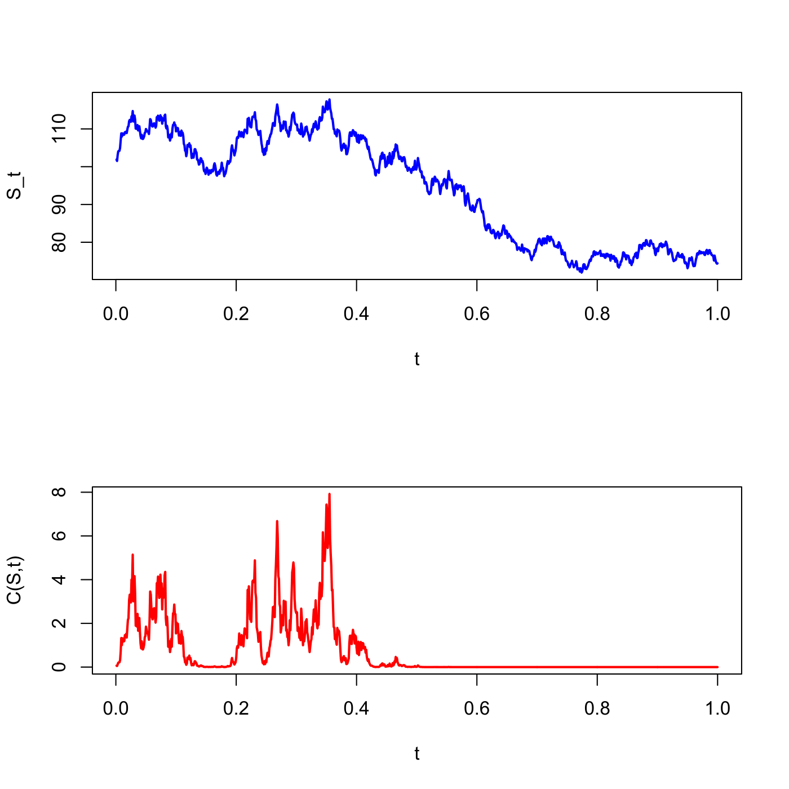

##  **SFEbsbm**

```yaml
Name of QuantLet : SFEbsbm
Published in: Statistics of Financial Markets
Description: 'Plots the Black-Scholes price as a function of S_t, which is modelled as a geometric Brownian motion.'
Keywords:
- asset
- black-scholes
- brownian-motion
- call
- european-option
- financial
- geometric-brownian-motion
- graphical representation
- option
- option-price
- plot
- price
- wiener-process
See also: SFSbb
Author:
- Awdesch Melzer
- Franziska Schulz
Submitted: Sat, July 25 2015 by quantomas
Example: 'The plot is generated for the following parameter values: S0=100, K=110, r=0.05, si=0.3, tau=0.02'
```




```r
# clear variables and close windows
rm(list = ls(all = TRUE))
graphics.off()

# install and load packages
libraries = c("fOptions")
lapply(libraries, function(x) if (!(x %in% installed.packages())) {
    install.packages(x)
})
lapply(libraries, library, quietly = TRUE, character.only = TRUE)

# parameter settings
S0 	= 100
K 	= 110
r 	= 0.05
si 	= 0.3
tau = 0.02

# Main computation
T 	= 1000
t 	= (1:T)/T
dt 	= t[2] - t[1]
Wt1 = rnorm(length(t), mean = 0, sd = 1)
Wt 	= cumsum(Wt1)  # cumulative sum
St 	= S0 * exp((r - 0.5 * si) * dt + si * sqrt(dt) * Wt)

# Valuation
Call 	= GBSOption(TypeFlag = "c", S = St, X = K, Time = tau, r = r, b = 0, sigma = si)  
Callp 	= attr(Call, "price")

# Plot
split.screen(c(2, 1))
screen(1)
plot(t, St, col = "blue", type = "l", lwd = 2, xlab = "t", ylab = "S_t")
screen(2)
plot(t, Callp, col = "red", type = "l", lwd = 2, xlab = "t", ylab = "C(S,t)") 

```
