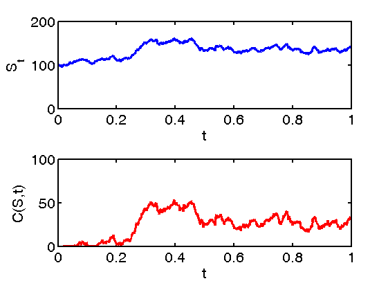

[](http://quantlet.de/index.php?p=info)

## [](http://quantlet.de/) **SFEbsbm** [](http://quantlet.de/d3/ia)

```yaml

Name of QuantLet : SFEbsbm

Published in : Statistics of Financial Markets

Description : 'Plots the Black-Scholes price as a function of S_t, which is modelled as a geometric
Brownian motion.'

Keywords : 'asset, black-scholes, brownian-motion, call, european-option, financial,
geometric-brownian-motion, graphical representation, option, option-price, plot, price,
wiener-process'

See also : SFSbb

Author : Awdesch Melzer, Franziska Schulz

Author[Matlab] : Szymon Borak

Submitted : Tue, July 01 2014 by Petra Burdejova

Output : Plot of the Call Black-Scholes price as a function of a Brownian Motion S_t.

Example : 'The plot is generated for the following parameter values: S0=100, K=110, r=0.05, si=0.3,
tau=0.02'

```




### R Code:
```r
# clear variables and close windows
rm(list = ls(all = TRUE))
graphics.off()

# install and load packages
libraries = c("fOptions")
lapply(libraries, function(x) if (!(x %in% installed.packages())) {
    install.packages(x)
})
lapply(libraries, library, quietly = TRUE, character.only = TRUE)

# parameter settings
S0 	= 100
K 	= 110
r 	= 0.05
si 	= 0.3
tau = 0.02

# Main computation
T 	= 1000
t 	= (1:T)/T
dt 	= t[2] - t[1]
Wt1 = rnorm(length(t), mean = 0, sd = 1)
Wt 	= cumsum(Wt1)  # cumulative sum
St 	= S0 * exp((r - 0.5 * si) * dt + si * sqrt(dt) * Wt)

# Valuation
Call 	= GBSOption(TypeFlag = "c", S = St, X = K, Time = tau, r = r, b = 0, sigma = si)  
Callp 	= attr(Call, "price")

# Plot
split.screen(c(2, 1))
screen(1)
plot(t, St, col = "blue", type = "l", lwd = 2, xlab = "t", ylab = "S_t")
screen(2)
plot(t, Callp, col = "red", type = "l", lwd = 2, xlab = "t", ylab = "C(S,t)") 

```

### MATLAB Code:
```matlab

clear
close all
clc

% set parameters
S0 = 100;
K  = 110;
r = 0.05;
si  = 0.3;
tau = 0.02;

% main computation
T    = 1000;
t    = (1:T)/T;
dt   = t(2)-t(1);
Wt1  = normrnd(0,1,length(t),1);
Wt   = cumsum(Wt1);
St   = S0*exp((r-0.5*si )* dt + si * sqrt(dt) * Wt);
Call = zeros(size(St));
Put  = zeros(size(St));
for i=1:length(St)
[Call(i,:), Put(i,:)] = blsprice(St(i,:), K, r, si,tau);
end

% output
subplot(2,1,1)
plot(t,St,'b','LineWidth',2.5)
set(gca,'LineWidth',1.6)
set(gca,'FontSize',16)
xlabel('t')
ylabel('S_t')

subplot(2,1,2)
plot(t,Call,'r','LineWidth',2.5)
set(gca,'LineWidth',1.6)
set(gca,'FontSize',16)
xlabel('t')
ylabel('C(S,t)')
 
```
