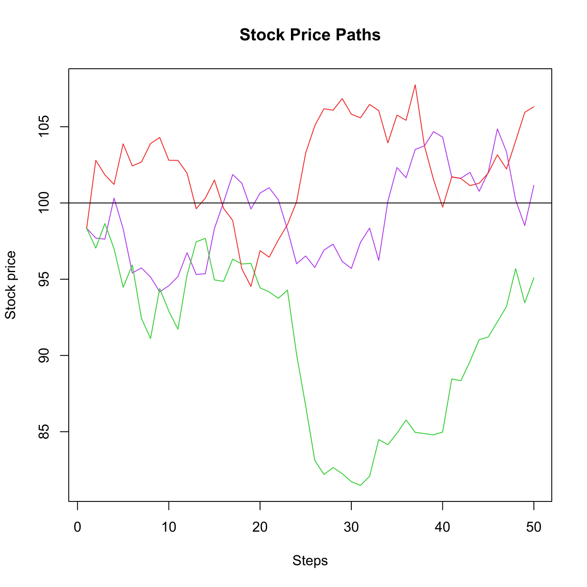
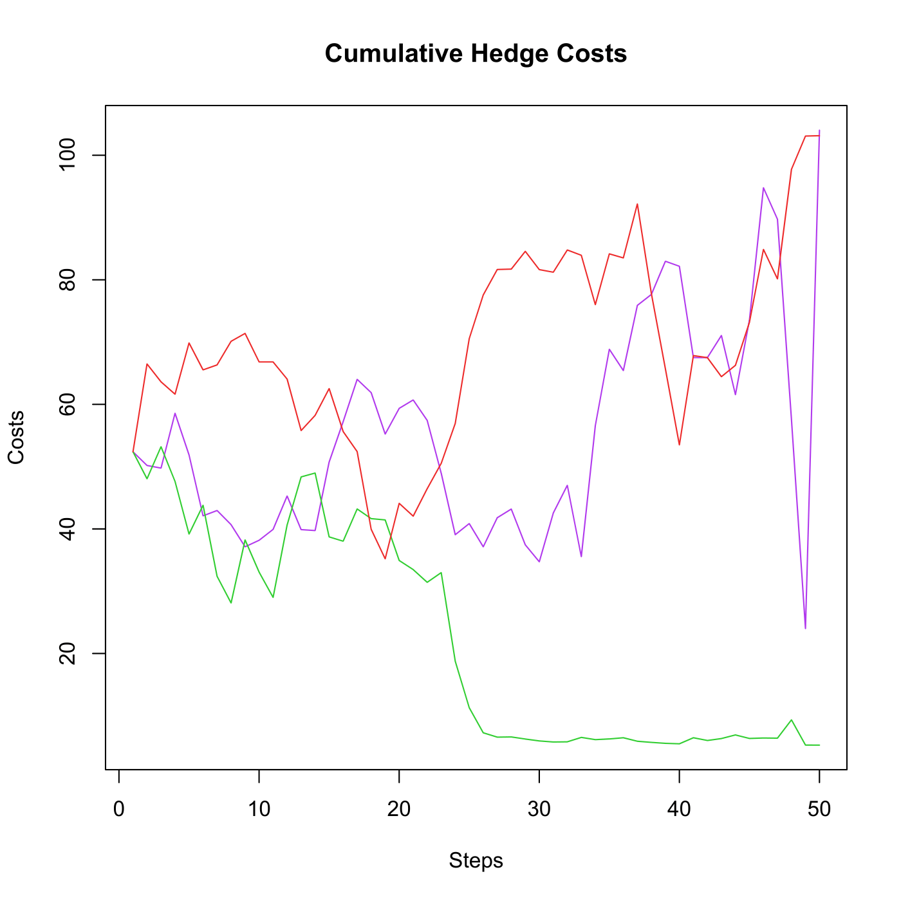

##  **SFEDeltaHedging**

```yaml
Name of QuantLet : SFEDeltaHedging
Published in: Statistics of Financial Markets
Description: 'Simulates 3 stock price path for a given specification of a geometric Brownian motion. For each of these paths the positions and cumulative costs of a Delta hedging strategy are plotted.'
Keywords:
- black-scholes
- brownian-motion
- delta
- financial
- geometric-brownian-motion
- graphical representation
- hedging
- plot
- simulation
- stock-price
- wiener-process
See also:
- SFEDeltahedgingLogic
- SFEDeltahedgingdepend
- SFSdeltahedging
Author: Felix Jung
Submitted: Sat, July 25 2015 by quantomas
```






```r
rm(list = ls(all = TRUE))
graphics.off()

# Declare stock price variables
n   = 50        # periods (steps)
S0  = 98        # initial stock price
sig = 0.2       # volatility (uniform distributed on 0.1 to 0.5)

# Declare option pricing variables
r   = 0.05      # interest rate (uniform distributed on 0 to 0.1)
K   = 100       # exerise price
t0  = 6/52      # current time (1 week = 1/52)
mat = 26/52     # maturity

GeneratePaths = function(S0, sig, maturity, K, r, n, t0) {
    dt 	= (maturity - t0)/n             # period between steps n 
    t 	= seq(t0, maturity, l = n)      # maturity - t0 divided in n intervals
    tau = maturity - t                  # time to maturity
    
    # Simulate the stock price path
    Wt 	= c(0, sqrt(dt) * cumsum(rnorm(n - 1, 0, 1)))
    S 	= S0 * exp((r - 0.5 * sig^2) * t + sig * Wt)
    
    # Compute delta and the associated hedging costs
    y               = (log(S/K) + (r - sig^2/2) * tau)/(sig * sqrt(tau))
    delta           = pnorm(y + sig * sqrt(tau))
    hedge.costs     = c(delta[1] * S[1], (delta[2:n] - delta[1:(n - 1)]) * S[2:n])
    cum.hedge.costs = cumsum(hedge.costs)
    
    # Result
    result = data.frame(S = S, CumCosts = cum.hedge.costs)
    return(result)
}

# Run three simulations
sim = cbind(GeneratePaths(S0 = S0, sig = sig, maturity = mat, K = K, r = r, n = n, 
    t0 = t0), GeneratePaths(S0 = S0, sig = sig, maturity = mat, K = K, r = r, n = n, 
    t0 = t0), GeneratePaths(S0 = S0, sig = sig, maturity = mat, K = K, r = r, n = n, 
    t0 = t0))

# Plot the stock prices
plot(x = 1:nrow(sim), y = sim[, 1], main = "Stock Price Paths", xlab = "Steps", ylab = "Stock price", 
    ylim = c(min(sim[, 1], sim[, 3], sim[, 5]), max(sim[, 1], sim[, 3], sim[, 5])), 
    type = "l", col = "darkorchid2")
lines(x = 1:nrow(sim), y = sim[, 3], col = "limegreen")
lines(x = 1:nrow(sim), y = sim[, 5], col = "firebrick2")
abline(h = K, col = 1)

# Plot cumulative hedge costs
dev.new()
plot(x = 1:nrow(sim), y = sim[, 2], main = "Cumulative Hedge Costs", xlab = "Steps", 
    ylab = "Costs", ylim = c(min(sim[, 2], sim[, 4], sim[, 6]), max(sim[, 2], sim[, 
        4], sim[, 6])), type = "l", col = "darkorchid2")
lines(x = 1:nrow(sim), y = sim[, 4], col = "limegreen")
lines(x = 1:nrow(sim), y = sim[, 6], col = "firebrick2") 

```
