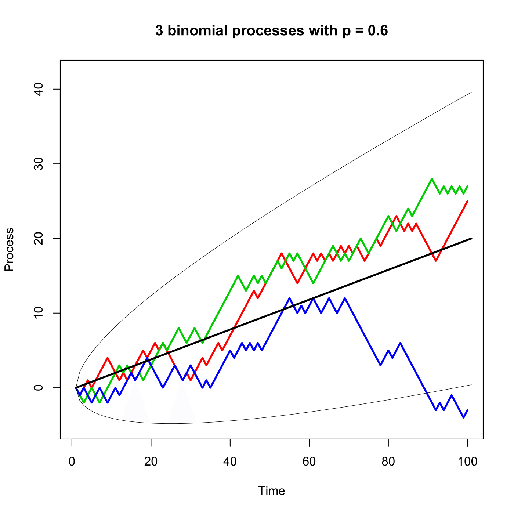

##  **SFEBinomp**

```yaml

Name of QuantLet : SFEBinomp

Published in: Statistics of Financial Markets

Description: 'Generates and plots 3 paths of a binomial process with p = 0.6. (2sigma)-intervals around the trend are given as well.'

Keywords:
- binomial
- discrete
- graphical representation
- plot
- process
- random
- random-number-generation
- random-walk
- simulation
- stochastic
- stochastic-process
- time-series

See also:
- SFEbinomv
- SFEbinomv_log

Author: Alexander Ristig

Submitted: Sat, July 25 2015 by quantomas

Input:
- n : number of observations
- k : number of trajectories
- p : probability of up movement

```




```r
# clear variables and close windows
rm(list = ls(all = TRUE))
graphics.off()

# parameter settings
set.seed(1)     # pseudo random numbers
n = 100         # number of observations
k = 3           # number of trajectories
p = 0.6         # probability of positive step being realised

# Main computation
t       = c(0:n)
trend   = t * (2 * p - 1)
std     = sqrt(4 * t * p * (1 - p))
s_1     = trend + 2 * std  # upper confidence band
s_2     = trend - 2 * std  # lower confidence band
z       = matrix(runif(k * n, min = (p - 1), max = p), k, n, byrow = TRUE)  # matrix of uniform random numbers
z       = (z > 0) * 1
z       = z * 2 - 1
walk    = matrix(0, k, n, byrow = TRUE)

for (i in 2:n) {
    walk[, i] = walk[, i - 1] + z[, i]
}
if (p == 0.5) {
    bound = c(-20, 20)
} else if (p > 0.5) {
    bound = c(-5, p * 70)
} else {
    bound = c((p - 1) * 70, 5)
}

# Plot first trajectory
plot(walk[1, ], type = "l", lwd = 2.5, col = "red", xlab = "Time", ylab = "Process", 
    ylim = bound, main = paste(k, "binomial processes with p =", p))

# Add remaining trajectories, if they exist
if (k > 1) {
    for (i in 2:k) {
        points(walk[i, ], type = "l", lwd = 2.5, col = (i + 1))  # all other trajectory
    }
}
points(s_1, type = "l", lwd = 0.5)    # upper confidence interval boundary
points(s_2, type = "l", lwd = 0.5)    # lower confidence interval boundary
points(trend, type = "l", lwd = 2.5)  # trend line 

```
