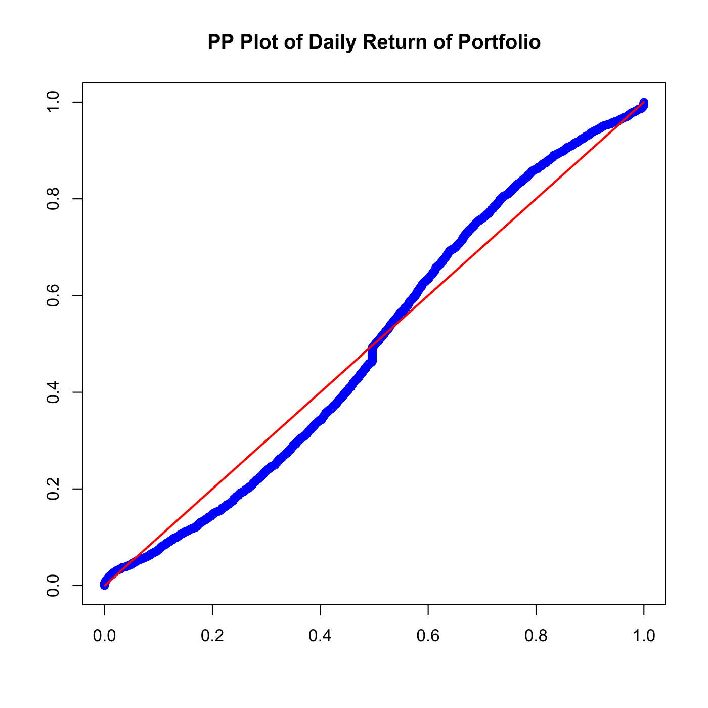
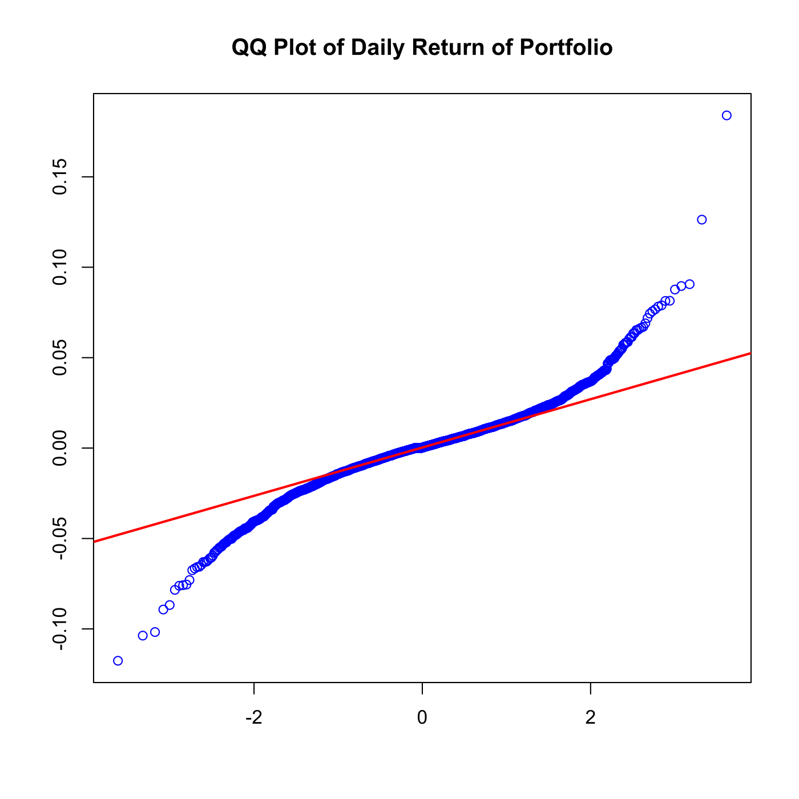

##  **SFEportfolio**

```yaml
Name of QuantLet : SFEportfolio
Published in: Statistics of Financial Markets
Description: 'Produces a PP and a QQ Plot of the portfolio of Bayer, BMW, Siemens and Volkswagen for the period 1 January 2002 - 31 December 2012, on daily basis.'
Keywords:
- asset
- data visualization
- dax
- financial
- graphical representation
- plot
- portfolio
- pp-plot
- qq-plot
- returns
- stock-price
See also:
- SFEclose
- SFEportlogreturns
- SFEtailGEV_pp
- SFEtailGEV_qq
- SFEtailGPareto_pp
- SFEtailGPareto_qq
Author:
- Barbara Choros-Tomczyk
- Awdesch Melzer
Submitted: Sat, July 25 2015 by quantomas
Datafiles:
- BAYER_close_0012.dat
- BMW_close_0012.dat
- SIEMENS_close_0012.dat
- VW_close_0012.dat
```






```r
rm(list = ls(all = TRUE))
graphics.off()

# load data
x1 = read.table("BAYER_close_0012.dat")
x2 = read.table("BMW_close_0012.dat")
x3 = read.table("SIEMENS_close_0012.dat")
x4 = read.table("VW_close_0012.dat")

r1 = diff(as.matrix(log(x1)))
r2 = diff(as.matrix(log(x2)))
r3 = diff(as.matrix(log(x3)))
r4 = diff(as.matrix(log(x4)))

# Variance efficient portfolio
portfolio   = cbind(r1, r2, r3, r4)
opti        = solve(cov(portfolio)) %*% c(1, 1, 1, 1)
opti        = opti/sum(opti)
returns2    = as.matrix(portfolio) %*% opti
x           = returns2

n           = nrow(x)
xf          = apply(x, 2, sort)
t           = (1:n)/(n + 1)
dat1        = cbind(pnorm((xf - mean(xf))/sd(xf)), t)
dat2        = cbind(t, t)

# PP Plot
plot(dat1, col = "blue", ylab = "", xlab = "", main = "PP Plot of Daily Return of Portfolio")
lines(dat2, col = "red", lwd = 2)

# QQ Plot
dev.new()
qqnorm(xf, col = "blue", xlab = "", ylab = "", main = "QQ Plot of Daily Return of Portfolio")
qqline(xf, col = "red", lwd = 2)

```
