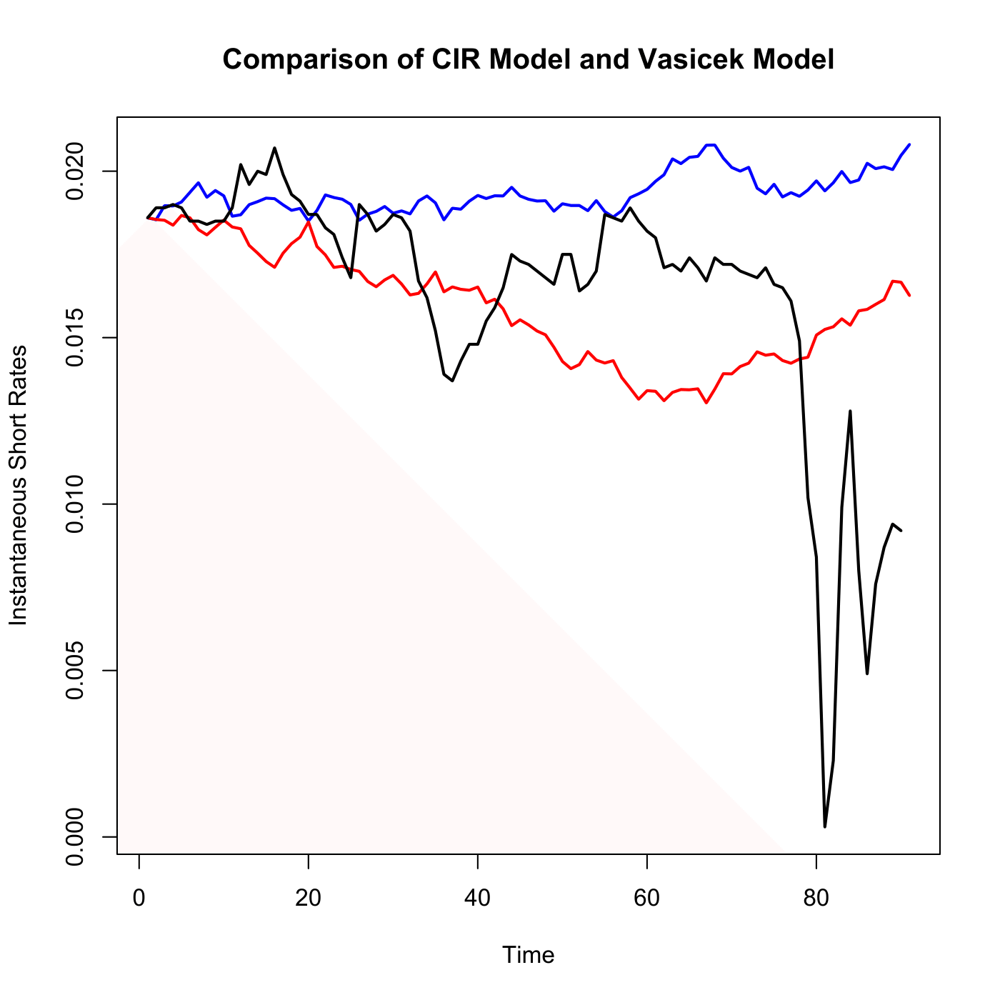

##  **SFEscomCIR**

```yaml
Name of QuantLet : SFEscomCIR
Published in: Statistics of Financial Markets
Description: Compares CIR and Vasicek models with the real data.
Keywords:
- cir
- graphical representation
- interest-rate
- plot
- process
- short-rate
- simulation
- time-series
- vasicek
See also:
- SFECIRmle
- SFEVasiml
- SFEcir
- SFEcirpricing
- SFEsimCIR
- SFEsimVasi
Author:
- Awdesch Melzer
- Li Sun
Submitted: Sat, July 25 2015 by quantomas
Datafiles: yield_US3month9808.txt
Input:
- a - a CIR
- b - b CIR
- sigma - sigma CIR
- a1 - a Vasicek
- b1 - b Vasicek
- sigma1 - sigma Vasicek
Example: 'An example is produced for a=0.221, b=0.020, sigma=0.055, a1=0.161, b1=0.014, sigma1= 0.009.'
```




```r
# clear variables and close windows
rm(list = ls(all = TRUE))
graphics.off()

set.seed(100)

# Load data
x = read.table("yield_US3month9808.txt")

# Parameters of the CIR model (a, b, sigma)
a      = 0.221     # a CIR
b      = 0.02      # b CIR
sigma  = 0.055     # instantaneous standard deviation

# Parameters of the Vasicek model (a1, b1, sigma1)
a1     = 0.161     # a Vasicek
b1     = 0.014     # b Vasicek
sigma1 = 0.009     # sigma Vasicek

T      = 90        # time
dt     = 1         # dt
R0     = 0.0186    # initial rate
N      = T/dt      # Number of time intervals of length dt in long time period T

# The initial short rate
R      = NULL
r      = NULL
R[1]   = R0
r[1]   = R0
R_sum  = 0
r_sum  = 0

# Simulation of the short rates
for (j in 1:10) {
    for (i in 1:N) {
        # CIR model
        R[i + 1] = R[i] + a * (b - R[i]) * (1/N) + sigma * sqrt(R[i]) * sqrt(1/N) * 
            rnorm(1, 0, 1)
    }
    R_sum = R_sum + R
}
Rm = R_sum/10

for (j in 1:10) {
    for (i in 1:N) {
        # Vasicek model
        r[i + 1] = r[i] + a1 * (b1 - r[i]) * (1/N) + sigma1 * sqrt(1/N) * rnorm(1, 
            0, 1)
    }
    r_sum = r_sum + r
}
rm = r_sum/10
y  = x[2601:2690, 1]/100

# Plot for the Short Rates vs Time
plot(Rm, col = "blue", type = "l", lwd = 2, xlab = c("Time"), ylab = c("Instantaneous Short Rates"), 
    ylim = c(min(Rm, rm, y), max(Rm, rm, y)))
lines(rm, col = "red", lwd = 2)
lines(y, col = "black", lwd = 2)
title("Comparison of CIR Model and Vasicek Model") 

```
