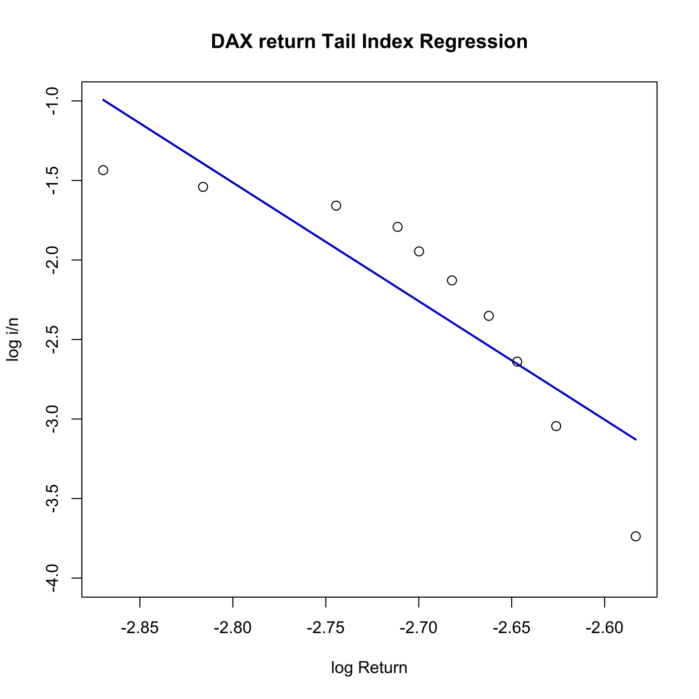
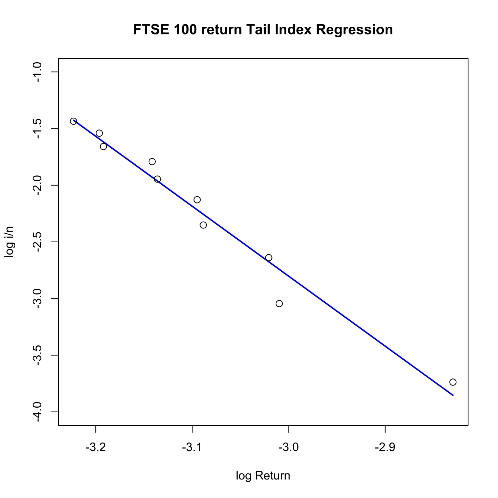

##  **SFEtail**

```yaml
Name of QuantLet : SFEtail Published in: Statistics of Financial Markets Description: 'Reads the
date, DAX index values, stock prices of 20 largest companies at Frankfurt Stock Exchange (FSE),
FTSE 100 index values and stock prices of 20 largest companies at London Stock Exchange (LSE) and
plots the right sides of the logged empirical distributions of the DAX and FTSE 100 daily returns
from 1998 to 2007 (m=10).' Keywords: - asset - data visualization - dax - descriptive-statistics -
financial - ftse100 - graphical representation - index - log-returns - plot - regression - returns
- stock-price - tail - time-series See also: - SFElshill - SFEmvol01 - SFEmvol03 - SFEtimeret -
SFEvolgarchest - SFEvolnonparest Author: - Andrija Mihoci - Awdesch Melzer Submitted: Sun, July 26
2015 by quantomas Datafiles: FSE_LSE.dat Example: - 'Plots of the tail index regression lines and
log observed returns of the DAX index from 1998 to 2007.' - 'Plots of the tail index regression
lines and log observed returns of the FTSE 100 index from 1998 to 2007.'
```






```r
# clear variables and close windows
rm(list = ls(all = TRUE))
graphics.off()

# install and load packages
libraries = c("matlab", "pracma")
lapply(libraries, function(x) if (!(x %in% installed.packages())) {
    install.packages(x)
})
lapply(libraries, library, quietly = TRUE, character.only = TRUE)

# Read data for FSE and LSE
DS	= read.table("FSE_LSE.dat")
D 	= DS[, 1]  							# date
S 	= DS[, 2:43]  						# S(t)
s 	= log(S)  							# log(S(t))
end	= length(D)
r 	= s[2:end, ] - s[1:(end - 1), ]		# r(t)
n 	= length(r)  						# sample size
t 	= c(1:n)  							# time index, t

# Tail index regression model - estimation of parameters

m1 = 10  # m1 largest observations

rsorted		= apply(r, 2, sort)
rswitched	= flipud(rsorted)

xs1=rswitched[1:m1,]
x1=log(xs1)
ys1 = log(c(1:m1)/n)
y1 	= kronecker(matrix(1, 1, 42), ys1)

pD 	= polyfit(x1[, 1], y1[, 1], 1)
pF 	= polyfit(x1[, 22], y1[, 22], 1)

fD 	= polyval(pD, x1[, 1])
fF 	= polyval(pF, x1[, 22])

# Tail index regression model - plots
plot(x1[, 1], fD, type = "l", col = "blue3", lwd = 2, xlab = "log Return", ylab = "log i/n", 
    ylim = c(-4, -1))
title("DAX return Tail Index Regression")
points(x1[, 1], y1[, 1], cex = 1.2, pch = 1)

dev.new()
plot(x1[, 22], fF, type = "l", col = "blue3", lwd = 2, xlab = "log Return", ylab = "log i/n", 
    ylim = c(-4, -1))
points(x1[, 22], y1[, 22], pch = 1, cex = 1.2)
title("FTSE 100 return Tail Index Regression") 

```
